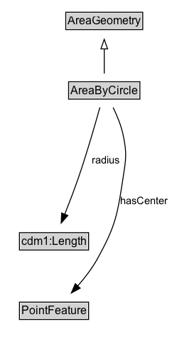

# AreaByCircle

An area geometry encoded as a circle.

## Diagram

=== "SVG (interactive)"

    <!-- Generated by graphviz version 14.1.3 (20260303.0454)
     -->
    <!-- Pages: 1 -->
    <svg width="181pt" height="365pt"
     viewBox="0.00 0.00 181.00 365.00" xmlns="http://www.w3.org/2000/svg" xmlns:xlink="http://www.w3.org/1999/xlink">
    <g id="graph0" class="graph" transform="scale(1 1) rotate(0) translate(4 360.5)">
    <polygon fill="white" stroke="none" points="-4,4 -4,-360.5 177.32,-360.5 177.32,4 -4,4"/>
    <g id="clust3" class="cluster">
    <title>cluster_associated</title>
    </g>
    <!-- AreaGeometry -->
    <g id="node1" class="node">
    <title>AreaGeometry</title>
    <g id="a_node1"><a xlink:href="../AreaGeometry" xlink:title="&lt;TABLE&gt;">
    <polygon fill="lightgray" stroke="none" points="66.38,-330.38 66.38,-346.62 145.62,-346.62 145.62,-330.38 66.38,-330.38"/>
    <text xml:space="preserve" text-anchor="start" x="67.38" y="-334.38" font-family="Arial" font-size="12.00">AreaGeometry</text>
    <polygon fill="none" stroke="black" points="65.38,-329.38 65.38,-347.62 146.62,-347.62 146.62,-329.38 65.38,-329.38"/>
    </a>
    </g>
    </g>
    <!-- AreaByCircle -->
    <g id="node2" class="node">
    <title>AreaByCircle</title>
    <g id="a_node2"><a xlink:href="../AreaByCircle" xlink:title="&lt;TABLE&gt;">
    <polygon fill="lightgray" stroke="none" points="69.38,-257.38 69.38,-273.62 142.62,-273.62 142.62,-257.38 69.38,-257.38"/>
    <text xml:space="preserve" text-anchor="start" x="70.38" y="-261.38" font-family="Arial" font-size="12.00">AreaByCircle</text>
    <polygon fill="none" stroke="black" points="68.38,-256.38 68.38,-274.62 143.62,-274.62 143.62,-256.38 68.38,-256.38"/>
    </a>
    </g>
    </g>
    <!-- AreaByCircle&#45;&gt;AreaGeometry -->
    <g id="edge1" class="edge">
    <title>AreaByCircle&#45;&gt;AreaGeometry</title>
    <path fill="none" stroke="black" d="M106,-283.21C106,-290.97 106,-300.42 106,-309.24"/>
    <polygon fill="none" stroke="black" points="102.5,-309.16 106,-319.16 109.5,-309.16 102.5,-309.16"/>
    </g>
    <!-- Invis -->
    <!-- AreaByCircle&#45;&gt;Invis -->
    <!-- cdm1_Length -->
    <g id="node4" class="node">
    <title>cdm1_Length</title>
    <g id="a_node4"><a xlink:href="https://w3id.org/citydata/part1/v1/Length" xlink:title="&lt;TABLE&gt;">
    <polygon fill="lightgray" stroke="none" points="17.5,-98.88 17.5,-115.12 88.5,-115.12 88.5,-98.88 17.5,-98.88"/>
    <text xml:space="preserve" text-anchor="start" x="18.5" y="-102.88" font-family="Arial" font-size="12.00">cdm1:Length</text>
    <polygon fill="none" stroke="black" points="16.5,-97.88 16.5,-116.12 89.5,-116.12 89.5,-97.88 16.5,-97.88"/>
    </a>
    </g>
    </g>
    <!-- AreaByCircle&#45;&gt;cdm1_Length -->
    <g id="edge6" class="edge">
    <title>AreaByCircle&#45;&gt;cdm1_Length</title>
    <path fill="none" stroke="black" d="M101.42,-247.78C96.35,-229.61 87.72,-199.79 79,-174.5 74.53,-161.53 69.07,-147.35 64.3,-135.43"/>
    <polygon fill="black" stroke="black" points="67.57,-134.17 60.58,-126.21 61.08,-136.79 67.57,-134.17"/>
    <text xml:space="preserve" text-anchor="middle" x="107.47" y="-188.8" font-family="Arial" font-size="11.00">radius</text>
    </g>
    <!-- PointFeature -->
    <g id="node5" class="node">
    <title>PointFeature</title>
    <g id="a_node5"><a xlink:href="../PointFeature" xlink:title="&lt;TABLE&gt;">
    <polygon fill="lightgray" stroke="none" points="17.5,-25.88 17.5,-42.12 88.5,-42.12 88.5,-25.88 17.5,-25.88"/>
    <text xml:space="preserve" text-anchor="start" x="18.5" y="-29.88" font-family="Arial" font-size="12.00">PointFeature</text>
    <polygon fill="none" stroke="black" points="16.5,-24.88 16.5,-43.12 89.5,-43.12 89.5,-24.88 16.5,-24.88"/>
    </a>
    </g>
    </g>
    <!-- AreaByCircle&#45;&gt;PointFeature -->
    <g id="edge5" class="edge">
    <title>AreaByCircle&#45;&gt;PointFeature</title>
    <path fill="none" stroke="black" d="M115.35,-247.58C119.49,-239.12 123.91,-228.56 126,-218.5 129.98,-199.35 128.98,-193.83 126,-174.5 119.93,-135.12 118.3,-123.86 99,-89 93.33,-78.76 85.54,-68.69 77.97,-60.07"/>
    <polygon fill="black" stroke="black" points="80.63,-57.78 71.29,-52.77 75.47,-62.51 80.63,-57.78"/>
    <text xml:space="preserve" text-anchor="middle" x="148.2" y="-146.05" font-family="Arial" font-size="11.00">hasCenter</text>
    </g>
    <!-- Invis&#45;&gt;cdm1_Length -->
    <!-- cdm1_Length&#45;&gt;PointFeature -->
    </g>
    </svg>

=== "PNG"

    

## Formalization for AreaByCircle

| Property | Constraint |
|----------|------------|
| [hasCenter](../properties/hasCenter.md) | only [PointFeature](https://w3id.org/itsdata/location/v1/PointFeature) |
| [radius](../properties/radius.md) | only [cdm1:Length](https://w3id.org/citydata/part1/v1/Length) |
| subClassOf | [AreaGeometry](AreaGeometry.md) |

