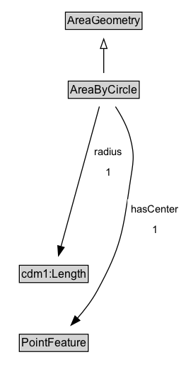

# AreaByCircle

An area geometry encoded as a circle.

## Diagram

=== "SVG (interactive)"

    <!-- Generated by graphviz version 14.1.3 (20260303.0454)
     -->
    <!-- Pages: 1 -->
    <svg width="197pt" height="401pt"
     viewBox="0.00 0.00 197.00 401.00" xmlns="http://www.w3.org/2000/svg" xmlns:xlink="http://www.w3.org/1999/xlink">
    <g id="graph0" class="graph" transform="scale(1 1) rotate(0) translate(4 397)">
    <polygon fill="white" stroke="none" points="-4,4 -4,-397 193.42,-397 193.42,4 -4,4"/>
    <g id="clust3" class="cluster">
    <title>cluster_associated</title>
    </g>
    <!-- AreaGeometry -->
    <g id="node1" class="node">
    <title>AreaGeometry</title>
    <g id="a_node1"><a xlink:href="../AreaGeometry" xlink:title="&lt;TABLE&gt;">
    <polygon fill="lightgray" stroke="none" points="66.38,-366.88 66.38,-383.12 145.62,-383.12 145.62,-366.88 66.38,-366.88"/>
    <text xml:space="preserve" text-anchor="start" x="67.38" y="-370.88" font-family="Arial" font-size="12.00">AreaGeometry</text>
    <polygon fill="none" stroke="black" points="65.38,-365.88 65.38,-384.12 146.62,-384.12 146.62,-365.88 65.38,-365.88"/>
    </a>
    </g>
    </g>
    <!-- AreaByCircle -->
    <g id="node2" class="node">
    <title>AreaByCircle</title>
    <g id="a_node2"><a xlink:href="../AreaByCircle" xlink:title="&lt;TABLE&gt;">
    <polygon fill="lightgray" stroke="none" points="69.38,-293.88 69.38,-310.12 142.62,-310.12 142.62,-293.88 69.38,-293.88"/>
    <text xml:space="preserve" text-anchor="start" x="70.38" y="-297.88" font-family="Arial" font-size="12.00">AreaByCircle</text>
    <polygon fill="none" stroke="black" points="68.38,-292.88 68.38,-311.12 143.62,-311.12 143.62,-292.88 68.38,-292.88"/>
    </a>
    </g>
    </g>
    <!-- AreaByCircle&#45;&gt;AreaGeometry -->
    <g id="edge1" class="edge">
    <title>AreaByCircle&#45;&gt;AreaGeometry</title>
    <path fill="none" stroke="black" d="M106,-319.71C106,-327.47 106,-336.92 106,-345.74"/>
    <polygon fill="none" stroke="black" points="102.5,-345.66 106,-355.66 109.5,-345.66 102.5,-345.66"/>
    </g>
    <!-- Invis -->
    <!-- AreaByCircle&#45;&gt;Invis -->
    <!-- cdm1_Length -->
    <g id="node4" class="node">
    <title>cdm1_Length</title>
    <g id="a_node4"><a xlink:href="https://w3id.org/citydata/part1/v1/Length" xlink:title="&lt;TABLE&gt;">
    <polygon fill="lightgray" stroke="none" points="17.5,-98.88 17.5,-115.12 88.5,-115.12 88.5,-98.88 17.5,-98.88"/>
    <text xml:space="preserve" text-anchor="start" x="18.5" y="-102.88" font-family="Arial" font-size="12.00">cdm1:Length</text>
    <polygon fill="none" stroke="black" points="16.5,-97.88 16.5,-116.12 89.5,-116.12 89.5,-97.88 16.5,-97.88"/>
    </a>
    </g>
    </g>
    <!-- AreaByCircle&#45;&gt;cdm1_Length -->
    <g id="edge6" class="edge">
    <title>AreaByCircle&#45;&gt;cdm1_Length</title>
    <path fill="none" stroke="black" d="M101.39,-284.21C92.27,-250.99 71.83,-176.57 60.66,-135.88"/>
    <polygon fill="black" stroke="black" points="64.06,-135.06 58.04,-126.35 57.31,-136.92 64.06,-135.06"/>
    <polygon fill="white" stroke="none" points="92.26,-204 92.26,-247 129.51,-247 129.51,-204 92.26,-204"/>
    <text xml:space="preserve" text-anchor="start" x="96.26" y="-232.5" font-family="Arial" font-size="11.00">radius</text>
    <text xml:space="preserve" text-anchor="start" x="107.88" y="-211" font-family="Arial" font-size="11.00">1</text>
    </g>
    <!-- PointFeature -->
    <g id="node5" class="node">
    <title>PointFeature</title>
    <g id="a_node5"><a xlink:href="../PointFeature" xlink:title="&lt;TABLE&gt;">
    <polygon fill="lightgray" stroke="none" points="17.5,-25.88 17.5,-42.12 88.5,-42.12 88.5,-25.88 17.5,-25.88"/>
    <text xml:space="preserve" text-anchor="start" x="18.5" y="-29.88" font-family="Arial" font-size="12.00">PointFeature</text>
    <polygon fill="none" stroke="black" points="16.5,-24.88 16.5,-43.12 89.5,-43.12 89.5,-24.88 16.5,-24.88"/>
    </a>
    </g>
    </g>
    <!-- AreaByCircle&#45;&gt;PointFeature -->
    <g id="edge5" class="edge">
    <title>AreaByCircle&#45;&gt;PointFeature</title>
    <path fill="none" stroke="black" d="M118.46,-284.09C124.43,-274.94 130.93,-263.15 134,-251.5 139.37,-231.08 137.11,-224.88 134,-204 126.14,-151.16 124.64,-135.87 99,-89 93.39,-78.74 85.6,-68.65 78.04,-60.03"/>
    <polygon fill="black" stroke="black" points="80.69,-57.75 71.35,-52.74 75.53,-62.48 80.69,-57.75"/>
    <polygon fill="white" stroke="none" points="131.17,-143 131.17,-186 189.42,-186 189.42,-143 131.17,-143"/>
    <text xml:space="preserve" text-anchor="start" x="135.17" y="-171.5" font-family="Arial" font-size="11.00">hasCenter</text>
    <text xml:space="preserve" text-anchor="start" x="157.3" y="-150" font-family="Arial" font-size="11.00">1</text>
    </g>
    <!-- Invis&#45;&gt;cdm1_Length -->
    <!-- cdm1_Length&#45;&gt;PointFeature -->
    </g>
    </svg>

=== "PNG"

    

## Formalization for AreaByCircle

| Property | Constraint |
|----------|------------|
| [hasCenter](../properties/hasCenter.md) | exactly 1 [PointFeature](https://w3id.org/itsdata/location/v1/PointFeature) |
| [radius](../properties/radius.md) | exactly 1 [cdm1:Length](https://w3id.org/citydata/part1/v1/Length) |
| subClassOf | [AreaGeometry](AreaGeometry.md) |

