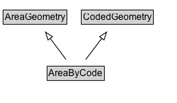

# AreaByCode

An area geometry whose extent is not modelled here but can be resolved using :hasLookupCode and an external location referencing system.

## Diagram

=== "SVG (interactive)"

    <!-- Generated by graphviz version 14.1.3 (20260303.0454)
     -->
    <!-- Pages: 1 -->
    <svg width="226pt" height="132pt"
     viewBox="0.00 0.00 226.00 132.00" xmlns="http://www.w3.org/2000/svg" xmlns:xlink="http://www.w3.org/1999/xlink">
    <g id="graph0" class="graph" transform="scale(1 1) rotate(0) translate(4 128)">
    <polygon fill="white" stroke="none" points="-4,4 -4,-128 221.62,-128 221.62,4 -4,4"/>
    <g id="clust3" class="cluster">
    <title>cluster_associated</title>
    </g>
    <!-- AreaGeometry -->
    <g id="node1" class="node">
    <title>AreaGeometry</title>
    <g id="a_node1"><a xlink:href="../AreaGeometry" xlink:title="&lt;TABLE&gt;">
    <polygon fill="lightgray" stroke="none" points="1,-97.88 1,-114.12 80.25,-114.12 80.25,-97.88 1,-97.88"/>
    <text xml:space="preserve" text-anchor="start" x="2" y="-101.88" font-family="Arial" font-size="12.00">AreaGeometry</text>
    <polygon fill="none" stroke="black" points="0,-96.88 0,-115.12 81.25,-115.12 81.25,-96.88 0,-96.88"/>
    </a>
    </g>
    </g>
    <!-- CodedGeometry -->
    <g id="node2" class="node">
    <title>CodedGeometry</title>
    <g id="a_node2"><a xlink:href="../CodedGeometry" xlink:title="&lt;TABLE&gt;">
    <polygon fill="lightgray" stroke="none" points="100.75,-97.88 100.75,-114.12 190.5,-114.12 190.5,-97.88 100.75,-97.88"/>
    <text xml:space="preserve" text-anchor="start" x="101.75" y="-101.88" font-family="Arial" font-size="12.00">CodedGeometry</text>
    <polygon fill="none" stroke="black" points="99.75,-96.88 99.75,-115.12 191.5,-115.12 191.5,-96.88 99.75,-96.88"/>
    </a>
    </g>
    </g>
    <!-- AreaByCode -->
    <g id="node3" class="node">
    <title>AreaByCode</title>
    <g id="a_node3"><a xlink:href="../AreaByCode" xlink:title="&lt;TABLE&gt;">
    <polygon fill="lightgray" stroke="none" points="57.12,-25.88 57.12,-42.12 128.12,-42.12 128.12,-25.88 57.12,-25.88"/>
    <text xml:space="preserve" text-anchor="start" x="58.12" y="-29.88" font-family="Arial" font-size="12.00">AreaByCode</text>
    <polygon fill="none" stroke="black" points="56.12,-24.88 56.12,-43.12 129.12,-43.12 129.12,-24.88 56.12,-24.88"/>
    </a>
    </g>
    </g>
    <!-- AreaByCode&#45;&gt;AreaGeometry -->
    <g id="edge1" class="edge">
    <title>AreaByCode&#45;&gt;AreaGeometry</title>
    <path fill="none" stroke="black" d="M80.15,-51.79C74.1,-59.93 66.7,-69.9 59.94,-79"/>
    <polygon fill="none" stroke="black" points="57.27,-76.73 54.12,-86.84 62.89,-80.9 57.27,-76.73"/>
    </g>
    <!-- AreaByCode&#45;&gt;CodedGeometry -->
    <g id="edge2" class="edge">
    <title>AreaByCode&#45;&gt;CodedGeometry</title>
    <path fill="none" stroke="black" d="M105.34,-51.79C111.5,-59.93 119.05,-69.9 125.94,-79"/>
    <polygon fill="none" stroke="black" points="123.05,-80.99 131.88,-86.85 128.64,-76.76 123.05,-80.99"/>
    </g>
    <!-- Invis -->
    </g>
    </svg>

=== "PNG"

    

## Formalization for AreaByCode

| Property | Constraint |
|----------|------------|
| subClassOf | [AreaGeometry](AreaGeometry.md) |
| subClassOf | [CodedGeometry](CodedGeometry.md) |

