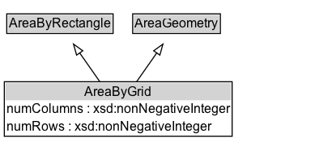

# AreaByGrid

An area geometry encoded as a grid. The rectangle defined by lower-left and upper-right is the base cell, which is replicated eastward (columns) and northward (rows).

## Diagram

=== "SVG (interactive)"

    <!-- Generated by graphviz version 14.1.3 (20260303.0454)
     -->
    <!-- Pages: 1 -->
    <svg width="308pt" height="139pt"
     viewBox="0.00 0.00 308.00 139.00" xmlns="http://www.w3.org/2000/svg" xmlns:xlink="http://www.w3.org/1999/xlink">
    <g id="graph0" class="graph" transform="scale(1 1) rotate(0) translate(4 135.38)">
    <polygon fill="white" stroke="none" points="-4,4 -4,-135.38 303.5,-135.38 303.5,4 -4,4"/>
    <g id="clust3" class="cluster">
    <title>cluster_associated</title>
    </g>
    <!-- AreaByRectangle -->
    <g id="node1" class="node">
    <title>AreaByRectangle</title>
    <g id="a_node1"><a xlink:href="../AreaByRectangle" xlink:title="&lt;TABLE&gt;">
    <polygon fill="lightgray" stroke="none" points="3.25,-105.25 3.25,-121.5 99.75,-121.5 99.75,-105.25 3.25,-105.25"/>
    <text xml:space="preserve" text-anchor="start" x="4.25" y="-109.25" font-family="Arial" font-size="12.00">AreaByRectangle</text>
    <polygon fill="none" stroke="black" points="2.25,-104.25 2.25,-122.5 100.75,-122.5 100.75,-104.25 2.25,-104.25"/>
    </a>
    </g>
    </g>
    <!-- AreaGeometry -->
    <g id="node2" class="node">
    <title>AreaGeometry</title>
    <g id="a_node2"><a xlink:href="../AreaGeometry" xlink:title="&lt;TABLE&gt;">
    <polygon fill="lightgray" stroke="none" points="119.88,-105.25 119.88,-121.5 199.12,-121.5 199.12,-105.25 119.88,-105.25"/>
    <text xml:space="preserve" text-anchor="start" x="120.88" y="-109.25" font-family="Arial" font-size="12.00">AreaGeometry</text>
    <polygon fill="none" stroke="black" points="118.88,-104.25 118.88,-122.5 200.12,-122.5 200.12,-104.25 118.88,-104.25"/>
    </a>
    </g>
    </g>
    <!-- AreaByGrid -->
    <g id="node3" class="node">
    <title>AreaByGrid</title>
    <g id="a_node3"><a xlink:href="../AreaByGrid" xlink:title="&lt;TABLE&gt;">
    <polygon fill="lightgray" stroke="none" points="1,-42.12 1,-58.38 210,-58.38 210,-42.12 1,-42.12"/>
    <text xml:space="preserve" text-anchor="start" x="74.38" y="-46.12" font-family="Arial" font-size="12.00">AreaByGrid</text>
    <text xml:space="preserve" text-anchor="start" x="2" y="-29.88" font-family="Arial" font-size="12.00">numColumns : xsd:nonNegativeInteger</text>
    <text xml:space="preserve" text-anchor="start" x="2" y="-13.62" font-family="Arial" font-size="12.00">numRows : xsd:nonNegativeInteger</text>
    <polygon fill="none" stroke="black" points="0,-8.62 0,-59.38 211,-59.38 211,-8.62 0,-8.62"/>
    </a>
    </g>
    </g>
    <!-- AreaByGrid&#45;&gt;AreaByRectangle -->
    <g id="edge1" class="edge">
    <title>AreaByGrid&#45;&gt;AreaByRectangle</title>
    <path fill="none" stroke="black" d="M88.68,-59.1C82.68,-67.7 75.89,-77.43 69.76,-86.2"/>
    <polygon fill="none" stroke="black" points="66.94,-84.14 64.08,-94.34 72.68,-88.15 66.94,-84.14"/>
    </g>
    <!-- AreaByGrid&#45;&gt;AreaGeometry -->
    <g id="edge2" class="edge">
    <title>AreaByGrid&#45;&gt;AreaGeometry</title>
    <path fill="none" stroke="black" d="M122.32,-59.1C128.32,-67.7 135.11,-77.43 141.24,-86.2"/>
    <polygon fill="none" stroke="black" points="138.32,-88.15 146.92,-94.34 144.06,-84.14 138.32,-88.15"/>
    </g>
    <!-- Invis -->
    </g>
    </svg>

=== "PNG"

    

## Formalization for AreaByGrid

| Property | Constraint |
|----------|------------|
| [numColumns](../properties/numColumns.md) | datatype xsd:nonNegativeInteger |
| [numRows](../properties/numRows.md) | datatype xsd:nonNegativeInteger |
| subClassOf | [AreaGeometry](AreaGeometry.md) |
| subClassOf | [AreaByRectangle](AreaByRectangle.md) |

