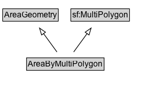

# AreaByMultiPolygon

An area geometry encoded as a MultiPolygon geometry.

## Diagram

=== "SVG (interactive)"

    <!-- Generated by graphviz version 14.1.3 (20260303.0454)
     -->
    <!-- Pages: 1 -->
    <svg width="245pt" height="132pt"
     viewBox="0.00 0.00 245.00 132.00" xmlns="http://www.w3.org/2000/svg" xmlns:xlink="http://www.w3.org/1999/xlink">
    <g id="graph0" class="graph" transform="scale(1 1) rotate(0) translate(4 128)">
    <polygon fill="white" stroke="none" points="-4,4 -4,-128 240.62,-128 240.62,4 -4,4"/>
    <g id="clust3" class="cluster">
    <title>cluster_associated</title>
    </g>
    <!-- AreaGeometry -->
    <g id="node1" class="node">
    <title>AreaGeometry</title>
    <g id="a_node1"><a xlink:href="../AreaGeometry" xlink:title="&lt;TABLE&gt;">
    <polygon fill="lightgray" stroke="none" points="1,-97.88 1,-114.12 80.25,-114.12 80.25,-97.88 1,-97.88"/>
    <text xml:space="preserve" text-anchor="start" x="2" y="-101.88" font-family="Arial" font-size="12.00">AreaGeometry</text>
    <polygon fill="none" stroke="black" points="0,-96.88 0,-115.12 81.25,-115.12 81.25,-96.88 0,-96.88"/>
    </a>
    </g>
    </g>
    <!-- sf_MultiPolygon -->
    <g id="node2" class="node">
    <title>sf_MultiPolygon</title>
    <g id="a_node2"><a xlink:href="https://w3id.org/citydata/imported/sf/latest/MultiPolygon" xlink:title="&lt;TABLE&gt;">
    <polygon fill="lightgray" stroke="none" points="100.75,-97.88 100.75,-114.12 184.5,-114.12 184.5,-97.88 100.75,-97.88"/>
    <text xml:space="preserve" text-anchor="start" x="101.75" y="-101.88" font-family="Arial" font-size="12.00">sf:MultiPolygon</text>
    <polygon fill="none" stroke="black" points="99.75,-96.88 99.75,-115.12 185.5,-115.12 185.5,-96.88 99.75,-96.88"/>
    </a>
    </g>
    </g>
    <!-- AreaByMultiPolygon -->
    <g id="node3" class="node">
    <title>AreaByMultiPolygon</title>
    <g id="a_node3"><a xlink:href="../AreaByMultiPolygon" xlink:title="&lt;TABLE&gt;">
    <polygon fill="lightgray" stroke="none" points="35.88,-25.88 35.88,-42.12 147.38,-42.12 147.38,-25.88 35.88,-25.88"/>
    <text xml:space="preserve" text-anchor="start" x="36.88" y="-29.88" font-family="Arial" font-size="12.00">AreaByMultiPolygon</text>
    <polygon fill="none" stroke="black" points="34.88,-24.88 34.88,-43.12 148.38,-43.12 148.38,-24.88 34.88,-24.88"/>
    </a>
    </g>
    </g>
    <!-- AreaByMultiPolygon&#45;&gt;AreaGeometry -->
    <g id="edge1" class="edge">
    <title>AreaByMultiPolygon&#45;&gt;AreaGeometry</title>
    <path fill="none" stroke="black" d="M79.39,-51.79C73.46,-59.93 66.2,-69.9 59.57,-79"/>
    <polygon fill="none" stroke="black" points="56.92,-76.69 53.86,-86.83 62.58,-80.81 56.92,-76.69"/>
    </g>
    <!-- AreaByMultiPolygon&#45;&gt;sf_MultiPolygon -->
    <g id="edge2" class="edge">
    <title>AreaByMultiPolygon&#45;&gt;sf_MultiPolygon</title>
    <path fill="none" stroke="black" d="M103.86,-51.79C109.79,-59.93 117.05,-69.9 123.68,-79"/>
    <polygon fill="none" stroke="black" points="120.67,-80.81 129.39,-86.83 126.33,-76.69 120.67,-80.81"/>
    </g>
    <!-- Invis -->
    </g>
    </svg>

=== "PNG"

    

## Formalization for AreaByMultiPolygon

| Property | Constraint |
|----------|------------|
| subClassOf | [AreaGeometry](AreaGeometry.md) |
| subClassOf | [sf:MultiPolygon](https://w3id.org/citydata/imported/sf/MultiPolygon) |

