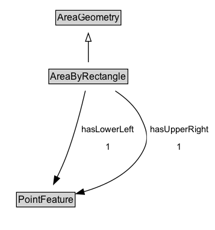

# AreaByRectangle

An area geometry encoded as a rectangle, defined by a lower-left corner and an upper-right corner.

## Diagram

=== "SVG (interactive)"

    <!-- Generated by graphviz version 14.1.3 (20260303.0454)
     -->
    <!-- Pages: 1 -->
    <svg width="268pt" height="286pt"
     viewBox="0.00 0.00 268.00 286.00" xmlns="http://www.w3.org/2000/svg" xmlns:xlink="http://www.w3.org/1999/xlink">
    <g id="graph0" class="graph" transform="scale(1 1) rotate(0) translate(4 282)">
    <polygon fill="white" stroke="none" points="-4,4 -4,-282 263.56,-282 263.56,4 -4,4"/>
    <g id="clust3" class="cluster">
    <title>cluster_associated</title>
    </g>
    <!-- AreaGeometry -->
    <g id="node1" class="node">
    <title>AreaGeometry</title>
    <g id="a_node1"><a xlink:href="../AreaGeometry" xlink:title="&lt;TABLE&gt;">
    <polygon fill="lightgray" stroke="none" points="66.38,-251.88 66.38,-268.12 145.62,-268.12 145.62,-251.88 66.38,-251.88"/>
    <text xml:space="preserve" text-anchor="start" x="67.38" y="-255.88" font-family="Arial" font-size="12.00">AreaGeometry</text>
    <polygon fill="none" stroke="black" points="65.38,-250.88 65.38,-269.12 146.62,-269.12 146.62,-250.88 65.38,-250.88"/>
    </a>
    </g>
    </g>
    <!-- AreaByRectangle -->
    <g id="node2" class="node">
    <title>AreaByRectangle</title>
    <g id="a_node2"><a xlink:href="../AreaByRectangle" xlink:title="&lt;TABLE&gt;">
    <polygon fill="lightgray" stroke="none" points="57.75,-178.88 57.75,-195.12 154.25,-195.12 154.25,-178.88 57.75,-178.88"/>
    <text xml:space="preserve" text-anchor="start" x="58.75" y="-182.88" font-family="Arial" font-size="12.00">AreaByRectangle</text>
    <polygon fill="none" stroke="black" points="56.75,-177.88 56.75,-196.12 155.25,-196.12 155.25,-177.88 56.75,-177.88"/>
    </a>
    </g>
    </g>
    <!-- AreaByRectangle&#45;&gt;AreaGeometry -->
    <g id="edge1" class="edge">
    <title>AreaByRectangle&#45;&gt;AreaGeometry</title>
    <path fill="none" stroke="black" d="M106,-204.71C106,-212.47 106,-221.92 106,-230.74"/>
    <polygon fill="none" stroke="black" points="102.5,-230.66 106,-240.66 109.5,-230.66 102.5,-230.66"/>
    </g>
    <!-- Invis -->
    <!-- AreaByRectangle&#45;&gt;Invis -->
    <!-- PointFeature -->
    <g id="node4" class="node">
    <title>PointFeature</title>
    <g id="a_node4"><a xlink:href="../PointFeature" xlink:title="&lt;TABLE&gt;">
    <polygon fill="lightgray" stroke="none" points="17.5,-25.88 17.5,-42.12 88.5,-42.12 88.5,-25.88 17.5,-25.88"/>
    <text xml:space="preserve" text-anchor="start" x="18.5" y="-29.88" font-family="Arial" font-size="12.00">PointFeature</text>
    <polygon fill="none" stroke="black" points="16.5,-24.88 16.5,-43.12 89.5,-43.12 89.5,-24.88 16.5,-24.88"/>
    </a>
    </g>
    </g>
    <!-- AreaByRectangle&#45;&gt;PointFeature -->
    <g id="edge4" class="edge">
    <title>AreaByRectangle&#45;&gt;PointFeature</title>
    <path fill="none" stroke="black" d="M102.29,-169.24C97.74,-149.67 89.35,-116.48 79,-89 75.6,-79.96 71.24,-70.38 67.08,-61.84"/>
    <polygon fill="black" stroke="black" points="70.28,-60.41 62.66,-53.04 64.02,-63.55 70.28,-60.41"/>
    <polygon fill="white" stroke="none" points="93.8,-89 93.8,-132 167.05,-132 167.05,-89 93.8,-89"/>
    <text xml:space="preserve" text-anchor="start" x="97.8" y="-117.5" font-family="Arial" font-size="11.00">hasLowerLeft</text>
    <text xml:space="preserve" text-anchor="start" x="127.42" y="-96" font-family="Arial" font-size="11.00">1</text>
    </g>
    <!-- AreaByRectangle&#45;&gt;PointFeature -->
    <g id="edge5" class="edge">
    <title>AreaByRectangle&#45;&gt;PointFeature</title>
    <path fill="none" stroke="black" d="M139.58,-169.04C151.8,-160.98 164.26,-150.1 171,-136.5 180.37,-117.58 182.41,-106.76 171,-89 155.41,-64.72 125.9,-51.22 100.28,-43.79"/>
    <polygon fill="black" stroke="black" points="101.25,-40.43 90.69,-41.26 99.47,-47.2 101.25,-40.43"/>
    <polygon fill="white" stroke="none" points="178.81,-89 178.81,-132 259.56,-132 259.56,-89 178.81,-89"/>
    <text xml:space="preserve" text-anchor="start" x="182.81" y="-117.5" font-family="Arial" font-size="11.00">hasUpperRight</text>
    <text xml:space="preserve" text-anchor="start" x="216.19" y="-96" font-family="Arial" font-size="11.00">1</text>
    </g>
    <!-- Invis&#45;&gt;PointFeature -->
    </g>
    </svg>

=== "PNG"

    

## Specializations of AreaByRectangle

| Class | Description |
|-------|-------------|
| [Area By Grid](AreaByGrid.md) | An area geometry encoded as a grid. The rectangle defined by lower-left and upper-right is the base cell, which is replicated eastward (columns) and northward (rows). |

## Formalization for AreaByRectangle

| Property | Constraint |
|----------|------------|
| [hasLowerLeft](../properties/hasLowerLeft.md) | exactly 1 [PointFeature](https://w3id.org/itsdata/location/v1/PointFeature) |
| [hasUpperRight](../properties/hasUpperRight.md) | exactly 1 [PointFeature](https://w3id.org/itsdata/location/v1/PointFeature) |
| subClassOf | [AreaGeometry](AreaGeometry.md) |

