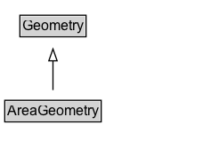

# AreaGeometry

A geometry that encodes an area location using a specific method.

NOTE: The boundary can consist of a single curvilinear line (e.g. a circle) or multiple curvilinear lines (e.g. the boundaries of city limits) and can consist of multiple enclosed areas.

EXAMPLE: The British Isles.

## Diagram

=== "SVG (interactive)"

    <!-- Generated by graphviz version 14.1.3 (20260303.0454)
     -->
    <!-- Pages: 1 -->
    <svg width="178pt" height="132pt"
     viewBox="0.00 0.00 178.00 132.00" xmlns="http://www.w3.org/2000/svg" xmlns:xlink="http://www.w3.org/1999/xlink">
    <g id="graph0" class="graph" transform="scale(1 1) rotate(0) translate(4 128)">
    <polygon fill="white" stroke="none" points="-4,4 -4,-128 173.62,-128 173.62,4 -4,4"/>
    <g id="clust3" class="cluster">
    <title>cluster_associated</title>
    </g>
    <!-- Geometry -->
    <g id="node1" class="node">
    <title>Geometry</title>
    <g id="a_node1"><a xlink:href="../Geometry" xlink:title="&lt;TABLE&gt;">
    <polygon fill="lightgray" stroke="none" points="13.75,-97.88 13.75,-114.12 67.5,-114.12 67.5,-97.88 13.75,-97.88"/>
    <text xml:space="preserve" text-anchor="start" x="14.75" y="-101.88" font-family="Arial" font-size="12.00">Geometry</text>
    <polygon fill="none" stroke="black" points="12.75,-96.88 12.75,-115.12 68.5,-115.12 68.5,-96.88 12.75,-96.88"/>
    </a>
    </g>
    </g>
    <!-- AreaGeometry -->
    <g id="node2" class="node">
    <title>AreaGeometry</title>
    <g id="a_node2"><a xlink:href="../AreaGeometry" xlink:title="&lt;TABLE&gt;">
    <polygon fill="lightgray" stroke="none" points="1,-25.88 1,-42.12 80.25,-42.12 80.25,-25.88 1,-25.88"/>
    <text xml:space="preserve" text-anchor="start" x="2" y="-29.88" font-family="Arial" font-size="12.00">AreaGeometry</text>
    <polygon fill="none" stroke="black" points="0,-24.88 0,-43.12 81.25,-43.12 81.25,-24.88 0,-24.88"/>
    </a>
    </g>
    </g>
    <!-- AreaGeometry&#45;&gt;Geometry -->
    <g id="edge1" class="edge">
    <title>AreaGeometry&#45;&gt;Geometry</title>
    <path fill="none" stroke="black" d="M40.62,-51.79C40.62,-59.25 40.62,-68.24 40.62,-76.69"/>
    <polygon fill="none" stroke="black" points="37.13,-76.54 40.63,-86.54 44.13,-76.54 37.13,-76.54"/>
    </g>
    <!-- Invis -->
    </g>
    </svg>

=== "PNG"

    

## Specializations of AreaGeometry

| Class | Description |
|-------|-------------|
| [Area By Circle](AreaByCircle.md) | An area geometry encoded as a circle. |
| [Area By Code](AreaByCode.md) | An area geometry whose extent is not modelled here but can be resolved using :hasLookupCode and an external location referencing system. |
| [Area By Grid](AreaByGrid.md) | An area geometry encoded as a grid. The rectangle defined by lower-left and upper-right is the base cell, which is replicated eastward (columns) and northward (rows). |
| [Area By Grid](AreaByGrid.md) | An area geometry encoded as a grid. The rectangle defined by lower-left and upper-right is the base cell, which is replicated eastward (columns) and northward (rows). |
| [Area By Linear Boundaries](AreaByLinearBoundaries.md) | An area geometry encoded as a set of linear boundary geometries. |
| [Area By Multi Polygon](AreaByMultiPolygon.md) | An area geometry encoded as a MultiPolygon geometry. |
| [Area By Polygon](AreaByPolygon.md) | An area geometry encoded as a Polygon geometry. |
| [Area By Rectangle](AreaByRectangle.md) | An area geometry encoded as a rectangle, defined by a lower-left corner and an upper-right corner. |

## Formalization for AreaGeometry

| Property | Constraint |
|----------|------------|
| subClassOf | [Geometry](Geometry.md) |

