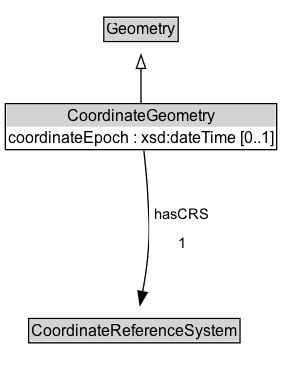

# CoordinateGeometry

A geometry that is represented by a coordinate system (i.e., directly encodes coordinate tuples).

## Diagram

=== "SVG (interactive)"

    <!-- Generated by graphviz version 14.1.3 (20260303.0454)
     -->
    <!-- Pages: 1 -->
    <svg width="212pt" height="286pt"
     viewBox="0.00 0.00 212.00 286.00" xmlns="http://www.w3.org/2000/svg" xmlns:xlink="http://www.w3.org/1999/xlink">
    <g id="graph0" class="graph" transform="scale(1 1) rotate(0) translate(4 282)">
    <polygon fill="white" stroke="none" points="-4,4 -4,-282 207.5,-282 207.5,4 -4,4"/>
    <g id="clust3" class="cluster">
    <title>cluster_associated</title>
    </g>
    <!-- Geometry -->
    <g id="node1" class="node">
    <title>Geometry</title>
    <g id="a_node1"><a xlink:href="../Geometry" xlink:title="&lt;TABLE&gt;">
    <polygon fill="lightgray" stroke="none" points="74.88,-251.88 74.88,-268.12 128.62,-268.12 128.62,-251.88 74.88,-251.88"/>
    <text xml:space="preserve" text-anchor="start" x="75.88" y="-255.88" font-family="Arial" font-size="12.00">Geometry</text>
    <polygon fill="none" stroke="black" points="73.88,-250.88 73.88,-269.12 129.62,-269.12 129.62,-250.88 73.88,-250.88"/>
    </a>
    </g>
    </g>
    <!-- CoordinateGeometry -->
    <g id="node2" class="node">
    <title>CoordinateGeometry</title>
    <g id="a_node2"><a xlink:href="../CoordinateGeometry" xlink:title="&lt;TABLE&gt;">
    <polygon fill="lightgray" stroke="none" points="1,-187 1,-203.25 202.5,-203.25 202.5,-187 1,-187"/>
    <text xml:space="preserve" text-anchor="start" x="46.25" y="-191" font-family="Arial" font-size="12.00">CoordinateGeometry</text>
    <text xml:space="preserve" text-anchor="start" x="2" y="-174.75" font-family="Arial" font-size="12.00">coordinateEpoch : xsd:dateTime [0..1]</text>
    <polygon fill="none" stroke="black" points="0,-169.75 0,-204.25 203.5,-204.25 203.5,-169.75 0,-169.75"/>
    </a>
    </g>
    </g>
    <!-- CoordinateGeometry&#45;&gt;Geometry -->
    <g id="edge1" class="edge">
    <title>CoordinateGeometry&#45;&gt;Geometry</title>
    <path fill="none" stroke="black" d="M101.75,-204.71C101.75,-212.47 101.75,-221.92 101.75,-230.74"/>
    <polygon fill="none" stroke="black" points="98.25,-230.66 101.75,-240.66 105.25,-230.66 98.25,-230.66"/>
    </g>
    <!-- Invis -->
    <!-- CoordinateGeometry&#45;&gt;Invis -->
    <!-- CoordinateReferenceSystem -->
    <g id="node4" class="node">
    <title>CoordinateReferenceSystem</title>
    <g id="a_node4"><a xlink:href="../CoordinateReferenceSystem" xlink:title="&lt;TABLE&gt;">
    <polygon fill="lightgray" stroke="none" points="18.5,-25.88 18.5,-42.12 175,-42.12 175,-25.88 18.5,-25.88"/>
    <text xml:space="preserve" text-anchor="start" x="19.5" y="-29.88" font-family="Arial" font-size="12.00">CoordinateReferenceSystem</text>
    <polygon fill="none" stroke="black" points="17.5,-24.88 17.5,-43.12 176,-43.12 176,-24.88 17.5,-24.88"/>
    </a>
    </g>
    </g>
    <!-- CoordinateGeometry&#45;&gt;CoordinateReferenceSystem -->
    <g id="edge4" class="edge">
    <title>CoordinateGeometry&#45;&gt;CoordinateReferenceSystem</title>
    <path fill="none" stroke="black" d="M103.88,-169.08C104.98,-159.53 106.2,-147.37 106.75,-136.5 107.81,-115.42 108.68,-110.02 106.75,-89 105.97,-80.48 104.51,-71.3 102.94,-62.97"/>
    <polygon fill="black" stroke="black" points="106.41,-62.51 101.01,-53.4 99.55,-63.89 106.41,-62.51"/>
    <polygon fill="white" stroke="none" points="107.89,-89 107.89,-132 157.14,-132 157.14,-89 107.89,-89"/>
    <text xml:space="preserve" text-anchor="start" x="111.89" y="-117.5" font-family="Arial" font-size="11.00">hasCRS</text>
    <text xml:space="preserve" text-anchor="start" x="129.52" y="-96" font-family="Arial" font-size="11.00">1</text>
    </g>
    <!-- Invis&#45;&gt;CoordinateReferenceSystem -->
    </g>
    </svg>

=== "PNG"

    

## Specializations of CoordinateGeometry

| Class | Description |
|-------|-------------|
| [Point By Coordinates](PointByCoordinates.md) | A coordinate tuple defining the geodetic position of a single point location using a known geodetic reference system |
| [Point By Geo Coordinates](PointByGeoCoordinates.md) | A point location geometry encoded as latitude/longitude and optional elements, such as elevation and metadata. |
| [Point By Projected Coordinates](PointByProjectedCoordinates.md) | A point location geometry encoded as projected coordinates and optional elements, such as elevation and metadata. |

## Formalization for CoordinateGeometry

| Property | Constraint |
|----------|------------|
| [coordinateEpoch](../properties/coordinateEpoch.md) | max 1 xsd:dateTime |
| [hasCRS](../properties/hasCRS.md) | exactly 1 [CoordinateReferenceSystem](https://w3id.org/itsdata/location/v1/CoordinateReferenceSystem) |
| subClassOf | [Geometry](Geometry.md) |

