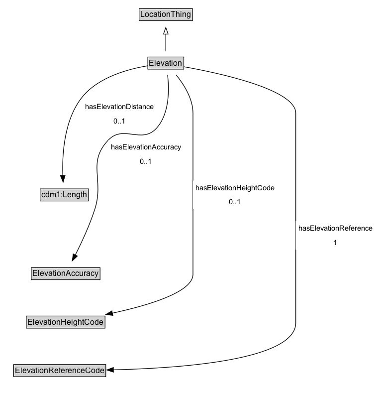

# Elevation

An elevation for a point location along with metadata.

## Diagram

=== "SVG (interactive)"

    <!-- Generated by graphviz version 14.1.3 (20260303.0454)
     -->
    <!-- Pages: 1 -->
    <svg width="570pt" height="596pt"
     viewBox="0.00 0.00 570.00 596.00" xmlns="http://www.w3.org/2000/svg" xmlns:xlink="http://www.w3.org/1999/xlink">
    <g id="graph0" class="graph" transform="scale(1 1) rotate(0) translate(4 592)">
    <polygon fill="white" stroke="none" points="-4,4 -4,-592 565.75,-592 565.75,4 -4,4"/>
    <g id="clust3" class="cluster">
    <title>cluster_associated</title>
    </g>
    <!-- LocationThing -->
    <g id="node1" class="node">
    <title>LocationThing</title>
    <g id="a_node1"><a xlink:href="../LocationThing" xlink:title="&lt;TABLE&gt;">
    <polygon fill="lightgray" stroke="none" points="206.75,-561.88 206.75,-578.12 285.25,-578.12 285.25,-561.88 206.75,-561.88"/>
    <text xml:space="preserve" text-anchor="start" x="207.75" y="-565.88" font-family="Arial" font-size="12.00">LocationThing</text>
    <polygon fill="none" stroke="black" points="205.75,-560.88 205.75,-579.12 286.25,-579.12 286.25,-560.88 205.75,-560.88"/>
    </a>
    </g>
    </g>
    <!-- Elevation -->
    <g id="node2" class="node">
    <title>Elevation</title>
    <g id="a_node2"><a xlink:href="../Elevation" xlink:title="&lt;TABLE&gt;">
    <polygon fill="lightgray" stroke="none" points="219.88,-488.88 219.88,-505.12 272.12,-505.12 272.12,-488.88 219.88,-488.88"/>
    <text xml:space="preserve" text-anchor="start" x="220.88" y="-492.88" font-family="Arial" font-size="12.00">Elevation</text>
    <polygon fill="none" stroke="black" points="218.88,-487.88 218.88,-506.12 273.12,-506.12 273.12,-487.88 218.88,-487.88"/>
    </a>
    </g>
    </g>
    <!-- Elevation&#45;&gt;LocationThing -->
    <g id="edge1" class="edge">
    <title>Elevation&#45;&gt;LocationThing</title>
    <path fill="none" stroke="black" d="M246,-514.71C246,-522.47 246,-531.92 246,-540.74"/>
    <polygon fill="none" stroke="black" points="242.5,-540.66 246,-550.66 249.5,-540.66 242.5,-540.66"/>
    </g>
    <!-- Invis -->
    <!-- Elevation&#45;&gt;Invis -->
    <!-- cdm1_Length -->
    <g id="node4" class="node">
    <title>cdm1_Length</title>
    <g id="a_node4"><a xlink:href="https://w3id.org/citydata/part1/v1/Length" xlink:title="&lt;TABLE&gt;">
    <polygon fill="lightgray" stroke="none" points="57.5,-290.38 57.5,-306.62 128.5,-306.62 128.5,-290.38 57.5,-290.38"/>
    <text xml:space="preserve" text-anchor="start" x="58.5" y="-294.38" font-family="Arial" font-size="12.00">cdm1:Length</text>
    <polygon fill="none" stroke="black" points="56.5,-289.38 56.5,-307.62 129.5,-307.62 129.5,-289.38 56.5,-289.38"/>
    </a>
    </g>
    </g>
    <!-- Elevation&#45;&gt;cdm1_Length -->
    <g id="edge8" class="edge">
    <title>Elevation&#45;&gt;cdm1_Length</title>
    <path fill="none" stroke="black" d="M219.03,-492.98C190.12,-488.25 145.1,-476.3 120.5,-446.5 92.66,-412.76 89.55,-359.77 90.68,-327.47"/>
    <polygon fill="black" stroke="black" points="94.16,-327.87 91.2,-317.7 87.17,-327.5 94.16,-327.87"/>
    <polygon fill="white" stroke="none" points="120.5,-399 120.5,-442 232,-442 232,-399 120.5,-399"/>
    <text xml:space="preserve" text-anchor="start" x="124.5" y="-427.5" font-family="Arial" font-size="11.00">hasElevationDistance</text>
    <text xml:space="preserve" text-anchor="start" x="167.25" y="-406" font-family="Arial" font-size="11.00">0..1</text>
    </g>
    <!-- ElevationAccuracy -->
    <g id="node5" class="node">
    <title>ElevationAccuracy</title>
    <g id="a_node5"><a xlink:href="../ElevationAccuracy" xlink:title="&lt;TABLE&gt;">
    <polygon fill="lightgray" stroke="none" points="44.12,-171.88 44.12,-188.12 145.88,-188.12 145.88,-171.88 44.12,-171.88"/>
    <text xml:space="preserve" text-anchor="start" x="45.12" y="-175.88" font-family="Arial" font-size="12.00">ElevationAccuracy</text>
    <polygon fill="none" stroke="black" points="43.12,-170.88 43.12,-189.12 146.88,-189.12 146.88,-170.88 43.12,-170.88"/>
    </a>
    </g>
    </g>
    <!-- Elevation&#45;&gt;ElevationAccuracy -->
    <g id="edge10" class="edge">
    <title>Elevation&#45;&gt;ElevationAccuracy</title>
    <path fill="none" stroke="black" d="M248.73,-479.27C251.2,-457.87 251.87,-420.95 232,-399 209.64,-374.31 182.2,-405.14 159.25,-381 126.8,-346.88 153.41,-321.83 139,-277 131.26,-252.93 119.09,-226.93 109.51,-208.06"/>
    <polygon fill="black" stroke="black" points="112.62,-206.46 104.91,-199.19 106.4,-209.68 112.62,-206.46"/>
    <polygon fill="white" stroke="none" points="159.25,-338 159.25,-381 273,-381 273,-338 159.25,-338"/>
    <text xml:space="preserve" text-anchor="start" x="163.25" y="-366.5" font-family="Arial" font-size="11.00">hasElevationAccuracy</text>
    <text xml:space="preserve" text-anchor="start" x="207.12" y="-345" font-family="Arial" font-size="11.00">0..1</text>
    </g>
    <!-- ElevationHeightCode -->
    <g id="node6" class="node">
    <title>ElevationHeightCode</title>
    <g id="a_node6"><a xlink:href="../ElevationHeightCode" xlink:title="&lt;TABLE&gt;">
    <polygon fill="lightgray" stroke="none" points="36.62,-98.88 36.62,-115.12 153.38,-115.12 153.38,-98.88 36.62,-98.88"/>
    <text xml:space="preserve" text-anchor="start" x="37.62" y="-102.88" font-family="Arial" font-size="12.00">ElevationHeightCode</text>
    <polygon fill="none" stroke="black" points="35.62,-97.88 35.62,-116.12 154.38,-116.12 154.38,-97.88 35.62,-97.88"/>
    </a>
    </g>
    </g>
    <!-- Elevation&#45;&gt;ElevationHeightCode -->
    <g id="edge9" class="edge">
    <title>Elevation&#45;&gt;ElevationHeightCode</title>
    <path fill="none" stroke="black" d="M261.73,-479.08C273.3,-464.84 287,-443.35 287,-421.5 287,-421.5 287,-421.5 287,-179 287,-152.15 220.12,-132.26 165.3,-120.47"/>
    <polygon fill="black" stroke="black" points="166.16,-117.07 155.65,-118.46 164.73,-123.93 166.16,-117.07"/>
    <polygon fill="white" stroke="none" points="287,-277 287,-320 414.25,-320 414.25,-277 287,-277"/>
    <text xml:space="preserve" text-anchor="start" x="291" y="-305.5" font-family="Arial" font-size="11.00">hasElevationHeightCode</text>
    <text xml:space="preserve" text-anchor="start" x="341.62" y="-284" font-family="Arial" font-size="11.00">0..1</text>
    </g>
    <!-- ElevationReferenceCode -->
    <g id="node7" class="node">
    <title>ElevationReferenceCode</title>
    <g id="a_node7"><a xlink:href="../ElevationReferenceCode" xlink:title="&lt;TABLE&gt;">
    <polygon fill="lightgray" stroke="none" points="17.5,-25.88 17.5,-42.12 154.5,-42.12 154.5,-25.88 17.5,-25.88"/>
    <text xml:space="preserve" text-anchor="start" x="18.5" y="-29.88" font-family="Arial" font-size="12.00">ElevationReferenceCode</text>
    <polygon fill="none" stroke="black" points="16.5,-24.88 16.5,-43.12 155.5,-43.12 155.5,-24.88 16.5,-24.88"/>
    </a>
    </g>
    </g>
    <!-- Elevation&#45;&gt;ElevationReferenceCode -->
    <g id="edge7" class="edge">
    <title>Elevation&#45;&gt;ElevationReferenceCode</title>
    <path fill="none" stroke="black" d="M272.84,-491.59C326.52,-482.02 442,-457.27 442,-421.5 442,-421.5 442,-421.5 442,-106 442,-50.21 271.72,-37.63 166.69,-35.17"/>
    <polygon fill="black" stroke="black" points="167.07,-31.68 157,-34.98 166.92,-38.68 167.07,-31.68"/>
    <polygon fill="white" stroke="none" points="442,-216 442,-259 561.75,-259 561.75,-216 442,-216"/>
    <text xml:space="preserve" text-anchor="start" x="446" y="-244.5" font-family="Arial" font-size="11.00">hasElevationReference</text>
    <text xml:space="preserve" text-anchor="start" x="498.88" y="-223" font-family="Arial" font-size="11.00">1</text>
    </g>
    <!-- Invis&#45;&gt;cdm1_Length -->
    <!-- cdm1_Length&#45;&gt;ElevationAccuracy -->
    <!-- ElevationAccuracy&#45;&gt;ElevationHeightCode -->
    <!-- ElevationHeightCode&#45;&gt;ElevationReferenceCode -->
    </g>
    </svg>

=== "PNG"

    

## Formalization for Elevation

| Property | Constraint |
|----------|------------|
| [hasElevationAccuracy](../properties/hasElevationAccuracy.md) | max 1 [ElevationAccuracy](https://w3id.org/itsdata/location/v1/ElevationAccuracy) |
| [hasElevationDistance](../properties/hasElevationDistance.md) | max 1 [cdm1:Length](https://w3id.org/citydata/part1/v1/Length) |
| [hasElevationHeightCode](../properties/hasElevationHeightCode.md) | max 1 [ElevationHeightCode](https://w3id.org/itsdata/location/v1/ElevationHeightCode) |
| [hasElevationReference](../properties/hasElevationReference.md) | exactly 1 [ElevationReferenceCode](https://w3id.org/itsdata/location/v1/ElevationReferenceCode) |
| subClassOf | [LocationThing](LocationThing.md) |

