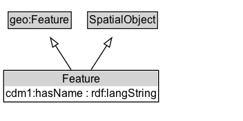

# Feature

An abstraction of real-world phenomena. An ITS-domain feature (subclass of geo:Feature) used to model real-world things that have a spatial location.

NOTE: Geographic features can be defined for any geographic entity that can be defined with geospatial boundaries, such as landmarks, buildings, transport infrastructure (e.g., road, pathway, railway, bridge structures, intersections, traffic signal cabinet, traffic signal pole, waterway), jurisdictional areas (e.g., country, city), etc.

## Diagram

=== "SVG (interactive)"

    <!-- Generated by graphviz version 14.1.3 (20260303.0454)
     -->
    <!-- Pages: 1 -->
    <svg width="264pt" height="132pt"
     viewBox="0.00 0.00 264.00 132.00" xmlns="http://www.w3.org/2000/svg" xmlns:xlink="http://www.w3.org/1999/xlink">
    <g id="graph0" class="graph" transform="scale(1 1) rotate(0) translate(4 128)">
    <polygon fill="white" stroke="none" points="-4,4 -4,-128 260.12,-128 260.12,4 -4,4"/>
    <g id="clust3" class="cluster">
    <title>cluster_associated</title>
    </g>
    <!-- geo_Feature -->
    <g id="node1" class="node">
    <title>geo_Feature</title>
    <g id="a_node1"><a xlink:href="https://w3id.org/citydata/imported/geo/latest/Feature" xlink:title="&lt;TABLE&gt;">
    <polygon fill="lightgray" stroke="none" points="5.88,-97.88 5.88,-114.12 72.38,-114.12 72.38,-97.88 5.88,-97.88"/>
    <text xml:space="preserve" text-anchor="start" x="6.88" y="-101.88" font-family="Arial" font-size="12.00">geo:Feature</text>
    <polygon fill="none" stroke="black" points="4.88,-96.88 4.88,-115.12 73.38,-115.12 73.38,-96.88 4.88,-96.88"/>
    </a>
    </g>
    </g>
    <!-- SpatialObject -->
    <g id="node2" class="node">
    <title>SpatialObject</title>
    <g id="a_node2"><a xlink:href="../SpatialObject" xlink:title="&lt;TABLE&gt;">
    <polygon fill="lightgray" stroke="none" points="92.12,-97.88 92.12,-114.12 166.12,-114.12 166.12,-97.88 92.12,-97.88"/>
    <text xml:space="preserve" text-anchor="start" x="93.12" y="-101.88" font-family="Arial" font-size="12.00">SpatialObject</text>
    <polygon fill="none" stroke="black" points="91.12,-96.88 91.12,-115.12 167.12,-115.12 167.12,-96.88 91.12,-96.88"/>
    </a>
    </g>
    </g>
    <!-- Feature -->
    <g id="node3" class="node">
    <title>Feature</title>
    <g id="a_node3"><a xlink:href="../Feature" xlink:title="&lt;TABLE&gt;">
    <polygon fill="lightgray" stroke="none" points="1,-34 1,-50.25 167.25,-50.25 167.25,-34 1,-34"/>
    <text xml:space="preserve" text-anchor="start" x="63.5" y="-38" font-family="Arial" font-size="12.00">Feature</text>
    <text xml:space="preserve" text-anchor="start" x="2" y="-21.75" font-family="Arial" font-size="12.00">cdm1:hasName : rdf:langString</text>
    <polygon fill="none" stroke="black" points="0,-16.75 0,-51.25 168.25,-51.25 168.25,-16.75 0,-16.75"/>
    </a>
    </g>
    </g>
    <!-- Feature&#45;&gt;geo_Feature -->
    <g id="edge1" class="edge">
    <title>Feature&#45;&gt;geo_Feature</title>
    <path fill="none" stroke="black" d="M73.33,-51.79C68.21,-59.76 61.96,-69.48 56.21,-78.43"/>
    <polygon fill="none" stroke="black" points="53.3,-76.48 50.84,-86.78 59.19,-80.26 53.3,-76.48"/>
    </g>
    <!-- Feature&#45;&gt;SpatialObject -->
    <g id="edge2" class="edge">
    <title>Feature&#45;&gt;SpatialObject</title>
    <path fill="none" stroke="black" d="M94.92,-51.79C100.04,-59.76 106.29,-69.48 112.04,-78.43"/>
    <polygon fill="none" stroke="black" points="109.06,-80.26 117.41,-86.78 114.95,-76.48 109.06,-80.26"/>
    </g>
    <!-- Invis -->
    </g>
    </svg>

=== "PNG"

    

## Specializations of Feature

| Class | Description |
|-------|-------------|
| [Area Location](AreaLocation.md) | A spatial location enclosed within a two-dimensional boundary or boundaries across a defined surface. |
| [Itinerary](Itinerary.md) | An ordered set of multiple physically separate locations forming a route or itinerary. |
| [Linear Location](LinearLocation.md) | A spatial location that extends between two point locations along a defined path |
| [Location](Location.md) | A particular place or position. |
| [Location Group](LocationGroup.md) | An unordered set of multiple physically separate locations. |
| [Point Location](PointLocation.md) | A spatial location with no length in any of the spatial dimensions. |
| [Spatial Location](SpatialLocation.md) | A location that is represented in three-dimensional space. |

## Formalization for Feature

| Property | Constraint |
|----------|------------|
| [cdm1:hasName](https://w3id.org/citydata/part1/v1/hasName) | datatype rdf:langString |
| subClassOf | [SpatialObject](SpatialObject.md) |
| subClassOf | [geo:Feature](https://w3id.org/citydata/imported/geo/Feature) |

