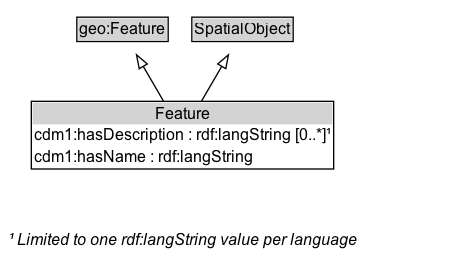

# Feature

An abstraction of real-world phenomena. An ITS-domain feature (subclass of geo:Feature) used to model real-world things that have a spatial location.

NOTE: Geographic features can be defined for any geographic entity that can be defined with geospatial boundaries, such as landmarks, buildings, transport infrastructure (e.g., road, pathway, railway, bridge structures, intersections, traffic signal cabinet, traffic signal pole, waterway), jurisdictional areas (e.g., country, city), etc.

## Diagram

=== "SVG (interactive)"

    <!-- Generated by graphviz version 14.1.3 (20260303.0454)
     -->
    <!-- Pages: 1 -->
    <svg width="342pt" height="203pt"
     viewBox="0.00 0.00 342.00 203.00" xmlns="http://www.w3.org/2000/svg" xmlns:xlink="http://www.w3.org/1999/xlink">
    <g id="graph0" class="graph" transform="scale(1 1) rotate(0) translate(4 198.75)">
    <polygon fill="white" stroke="none" points="-4,4 -4,-198.75 337.88,-198.75 337.88,4 -4,4"/>
    <g id="clust3" class="cluster">
    <title>cluster_associated</title>
    </g>
    <!-- geo_Feature -->
    <g id="node1" class="node">
    <title>geo_Feature</title>
    <g id="a_node1"><a xlink:href="https://w3id.org/citydata/imported/geo/latest/Feature" xlink:title="&lt;TABLE&gt;">
    <polygon fill="lightgray" stroke="none" points="54.62,-168.62 54.62,-184.88 121.12,-184.88 121.12,-168.62 54.62,-168.62"/>
    <text xml:space="preserve" text-anchor="start" x="55.62" y="-172.62" font-family="Arial" font-size="12.00">geo:Feature</text>
    <polygon fill="none" stroke="black" points="53.62,-167.62 53.62,-185.88 122.12,-185.88 122.12,-167.62 53.62,-167.62"/>
    </a>
    </g>
    </g>
    <!-- SpatialObject -->
    <g id="node2" class="node">
    <title>SpatialObject</title>
    <g id="a_node2"><a xlink:href="../SpatialObject" xlink:title="&lt;TABLE&gt;">
    <polygon fill="lightgray" stroke="none" points="140.88,-168.62 140.88,-184.88 214.88,-184.88 214.88,-168.62 140.88,-168.62"/>
    <text xml:space="preserve" text-anchor="start" x="141.88" y="-172.62" font-family="Arial" font-size="12.00">SpatialObject</text>
    <polygon fill="none" stroke="black" points="139.88,-167.62 139.88,-185.88 215.88,-185.88 215.88,-167.62 139.88,-167.62"/>
    </a>
    </g>
    </g>
    <!-- Feature -->
    <g id="node3" class="node">
    <title>Feature</title>
    <g id="a_node3"><a xlink:href="../Feature" xlink:title="&lt;TABLE&gt;">
    <polygon fill="lightgray" stroke="none" points="20.5,-105.5 20.5,-121.75 245.25,-121.75 245.25,-105.5 20.5,-105.5"/>
    <text xml:space="preserve" text-anchor="start" x="112.25" y="-109.5" font-family="Arial" font-size="12.00">Feature</text>
    <text xml:space="preserve" text-anchor="start" x="21.5" y="-93.25" font-family="Arial" font-size="12.00">cdm1:hasDescription : rdf:langString [0..&#42;]¹</text>
    <text xml:space="preserve" text-anchor="start" x="21.5" y="-77" font-family="Arial" font-size="12.00">cdm1:hasName : rdf:langString</text>
    <polygon fill="none" stroke="black" points="19.5,-72 19.5,-122.75 246.25,-122.75 246.25,-72 19.5,-72"/>
    </a>
    </g>
    </g>
    <!-- Feature&#45;&gt;geo_Feature -->
    <g id="edge1" class="edge">
    <title>Feature&#45;&gt;geo_Feature</title>
    <path fill="none" stroke="black" d="M118.86,-122.47C113.96,-130.89 108.44,-140.39 103.43,-149.01"/>
    <polygon fill="none" stroke="black" points="100.4,-147.25 98.4,-157.65 106.45,-150.77 100.4,-147.25"/>
    </g>
    <!-- Feature&#45;&gt;SpatialObject -->
    <g id="edge2" class="edge">
    <title>Feature&#45;&gt;SpatialObject</title>
    <path fill="none" stroke="black" d="M146.89,-122.47C151.79,-130.89 157.31,-140.39 162.32,-149.01"/>
    <polygon fill="none" stroke="black" points="159.3,-150.77 167.35,-157.65 165.35,-147.25 159.3,-150.77"/>
    </g>
    <!-- Feature_uniqueLang_note -->
    <g id="node5" class="node">
    <title>Feature_uniqueLang_note</title>
    <text xml:space="preserve" text-anchor="start" x="2" y="-14.72" font-family="Arial" font-style="italic" font-size="12.00">¹ Limited to one rdf:langString value per language</text>
    </g>
    <!-- Feature&#45;&gt;Feature_uniqueLang_note -->
    <!-- Invis -->
    </g>
    </svg>

=== "PNG"

    

## Specializations of Feature

| Class | Description |
|-------|-------------|
| [Area Feature](AreaFeature.md) | A spatial feature enclosed within a two-dimensional boundary or boundaries across a defined surface. |
| [Itinerary](Itinerary.md) | An ordered set of multiple physically separate features forming a route or itinerary. |
| [Linear Feature](LinearFeature.md) | A spatial feature that extends along a defined path (typically between two point features or along a network element). |
| [Location Group](LocationGroup.md) | An unordered set of multiple physically separate features (each typically a singular feature with its own geometry). |
| [Point Feature](PointFeature.md) | A spatial feature with no length in any of the spatial dimensions (a point phenomenon in space). |

## Formalization for Feature

| Property | Constraint |
|----------|------------|
| [cdm1:hasDescription](https://w3id.org/citydata/part1/v1/hasDescription) | 0..* rdf:langString (one per language) |
| [cdm1:hasName](https://w3id.org/citydata/part1/v1/hasName) | datatype rdf:langString |
| subClassOf | [SpatialObject](SpatialObject.md) |
| subClassOf | [geo:Feature](https://w3id.org/citydata/imported/geo/Feature) |

