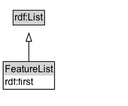

# FeatureList

An ordered list of member features (e.g., itinerary waypoints).

## Diagram

=== "SVG (interactive)"

    <!-- Generated by graphviz version 14.1.3 (20260303.0454)
     -->
    <!-- Pages: 1 -->
    <svg width="160pt" height="132pt"
     viewBox="0.00 0.00 160.00 132.00" xmlns="http://www.w3.org/2000/svg" xmlns:xlink="http://www.w3.org/1999/xlink">
    <g id="graph0" class="graph" transform="scale(1 1) rotate(0) translate(4 128)">
    <polygon fill="white" stroke="none" points="-4,4 -4,-128 156,-128 156,4 -4,4"/>
    <g id="clust3" class="cluster">
    <title>cluster_associated</title>
    </g>
    <!-- rdf_List -->
    <g id="node1" class="node">
    <title>rdf_List</title>
    <g id="a_node1"><a xlink:href="https://w3id.org/citydata/imported/rdf/latest/List" xlink:title="&lt;TABLE&gt;">
    <polygon fill="lightgray" stroke="none" points="13.38,-97.88 13.38,-114.12 50.62,-114.12 50.62,-97.88 13.38,-97.88"/>
    <text xml:space="preserve" text-anchor="start" x="14.38" y="-101.88" font-family="Arial" font-size="12.00">rdf:List</text>
    <polygon fill="none" stroke="black" points="12.38,-96.88 12.38,-115.12 51.62,-115.12 51.62,-96.88 12.38,-96.88"/>
    </a>
    </g>
    </g>
    <!-- FeatureList -->
    <g id="node2" class="node">
    <title>FeatureList</title>
    <g id="a_node2"><a xlink:href="../FeatureList" xlink:title="&lt;TABLE&gt;">
    <polygon fill="lightgray" stroke="none" points="1,-34 1,-50.25 63,-50.25 63,-34 1,-34"/>
    <text xml:space="preserve" text-anchor="start" x="2" y="-38" font-family="Arial" font-size="12.00">FeatureList</text>
    <text xml:space="preserve" text-anchor="start" x="2" y="-21.75" font-family="Arial" font-size="12.00">rdf:first</text>
    <polygon fill="none" stroke="black" points="0,-16.75 0,-51.25 64,-51.25 64,-16.75 0,-16.75"/>
    </a>
    </g>
    </g>
    <!-- FeatureList&#45;&gt;rdf_List -->
    <g id="edge1" class="edge">
    <title>FeatureList&#45;&gt;rdf_List</title>
    <path fill="none" stroke="black" d="M32,-51.79C32,-59.25 32,-68.24 32,-76.69"/>
    <polygon fill="none" stroke="black" points="28.5,-76.54 32,-86.54 35.5,-76.54 28.5,-76.54"/>
    </g>
    <!-- Invis -->
    </g>
    </svg>

=== "PNG"

    

## Formalization for FeatureList

| Property | Constraint |
|----------|------------|
| [rdf:first](https://w3id.org/citydata/imported/rdf/first) | only [Feature](https://w3id.org/itsdata/location/v1/Feature) |
| subClassOf | [rdf:List](https://w3id.org/citydata/imported/rdf/List) |

