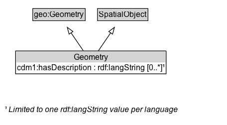

# Geometry

A description of a spatial location in the real world according to a defined reference system.

NOTE: A Geometry can be complex, such as a jurisdictional area that consists of multiple islands.

## Diagram

=== "SVG (interactive)"

    <!-- Generated by graphviz version 14.1.3 (20260303.0454)
     -->
    <!-- Pages: 1 -->
    <svg width="342pt" height="188pt"
     viewBox="0.00 0.00 342.00 188.00" xmlns="http://www.w3.org/2000/svg" xmlns:xlink="http://www.w3.org/1999/xlink">
    <g id="graph0" class="graph" transform="scale(1 1) rotate(0) translate(4 184)">
    <polygon fill="white" stroke="none" points="-4,4 -4,-184 337.88,-184 337.88,4 -4,4"/>
    <g id="clust3" class="cluster">
    <title>cluster_associated</title>
    </g>
    <!-- geo_Geometry -->
    <g id="node1" class="node">
    <title>geo_Geometry</title>
    <g id="a_node1"><a xlink:href="https://w3id.org/citydata/imported/geo/latest/Geometry" xlink:title="&lt;TABLE&gt;">
    <polygon fill="lightgray" stroke="none" points="46.38,-153.88 46.38,-170.12 123.38,-170.12 123.38,-153.88 46.38,-153.88"/>
    <text xml:space="preserve" text-anchor="start" x="47.38" y="-157.88" font-family="Arial" font-size="12.00">geo:Geometry</text>
    <polygon fill="none" stroke="black" points="45.38,-152.88 45.38,-171.12 124.38,-171.12 124.38,-152.88 45.38,-152.88"/>
    </a>
    </g>
    </g>
    <!-- SpatialObject -->
    <g id="node2" class="node">
    <title>SpatialObject</title>
    <g id="a_node2"><a xlink:href="../SpatialObject" xlink:title="&lt;TABLE&gt;">
    <polygon fill="lightgray" stroke="none" points="143.88,-153.88 143.88,-170.12 217.88,-170.12 217.88,-153.88 143.88,-153.88"/>
    <text xml:space="preserve" text-anchor="start" x="144.88" y="-157.88" font-family="Arial" font-size="12.00">SpatialObject</text>
    <polygon fill="none" stroke="black" points="142.88,-152.88 142.88,-171.12 218.88,-171.12 218.88,-152.88 142.88,-152.88"/>
    </a>
    </g>
    </g>
    <!-- Geometry -->
    <g id="node3" class="node">
    <title>Geometry</title>
    <g id="a_node3"><a xlink:href="../Geometry" xlink:title="&lt;TABLE&gt;">
    <polygon fill="lightgray" stroke="none" points="20.5,-90 20.5,-106.25 245.25,-106.25 245.25,-90 20.5,-90"/>
    <text xml:space="preserve" text-anchor="start" x="107" y="-94" font-family="Arial" font-size="12.00">Geometry</text>
    <text xml:space="preserve" text-anchor="start" x="21.5" y="-77.75" font-family="Arial" font-size="12.00">cdm1:hasDescription : rdf:langString [0..&#42;]¹</text>
    <polygon fill="none" stroke="black" points="19.5,-72.75 19.5,-107.25 246.25,-107.25 246.25,-72.75 19.5,-72.75"/>
    </a>
    </g>
    </g>
    <!-- Geometry&#45;&gt;geo_Geometry -->
    <g id="edge1" class="edge">
    <title>Geometry&#45;&gt;geo_Geometry</title>
    <path fill="none" stroke="black" d="M121.36,-107.79C115.84,-115.85 109.09,-125.69 102.9,-134.71"/>
    <polygon fill="none" stroke="black" points="100.12,-132.58 97.35,-142.81 105.89,-136.54 100.12,-132.58"/>
    </g>
    <!-- Geometry&#45;&gt;SpatialObject -->
    <g id="edge2" class="edge">
    <title>Geometry&#45;&gt;SpatialObject</title>
    <path fill="none" stroke="black" d="M144.39,-107.79C149.91,-115.85 156.66,-125.69 162.85,-134.71"/>
    <polygon fill="none" stroke="black" points="159.86,-136.54 168.4,-142.81 165.63,-132.58 159.86,-136.54"/>
    </g>
    <!-- Geometry_uniqueLang_note -->
    <g id="node5" class="node">
    <title>Geometry_uniqueLang_note</title>
    <text xml:space="preserve" text-anchor="start" x="2" y="-14.72" font-family="Arial" font-style="italic" font-size="12.00">¹ Limited to one rdf:langString value per language</text>
    </g>
    <!-- Geometry&#45;&gt;Geometry_uniqueLang_note -->
    <!-- Invis -->
    </g>
    </svg>

=== "PNG"

    

## Specializations of Geometry

| Class | Description |
|-------|-------------|
| [Area By Circle](AreaByCircle.md) | An area geometry encoded as a circle. |
| [Area By Code](AreaByCode.md) | An area geometry whose extent is not modelled here but can be resolved using :hasLookupCode and an external location referencing system. |
| [Area By Code](AreaByCode.md) | An area geometry whose extent is not modelled here but can be resolved using :hasLookupCode and an external location referencing system. |
| [Area By Grid](AreaByGrid.md) | An area geometry encoded as a grid. The rectangle defined by lower-left and upper-right is the base cell, which is replicated eastward (columns) and northward (rows). |
| [Area By Grid](AreaByGrid.md) | An area geometry encoded as a grid. The rectangle defined by lower-left and upper-right is the base cell, which is replicated eastward (columns) and northward (rows). |
| [Area By Linear Boundaries](AreaByLinearBoundaries.md) | An area geometry encoded as a set of linear boundary geometries. |
| [Area By Multi Polygon](AreaByMultiPolygon.md) | An area geometry encoded as a MultiPolygon geometry. |
| [Area By Polygon](AreaByPolygon.md) | An area geometry encoded as a Polygon geometry. |
| [Area By Rectangle](AreaByRectangle.md) | An area geometry encoded as a rectangle, defined by a lower-left corner and an upper-right corner. |
| [Area Geometry](AreaGeometry.md) | A geometry that encodes an area location using a specific method. |
| [Coded Geometry](CodedGeometry.md) | A geometry whose extent is resolved via an external code, registry, or service (a pointer to a geometry held elsewhere). |
| [Coordinate Geometry](CoordinateGeometry.md) | A geometry that is represented by a coordinate system (i.e., directly encodes coordinate tuples). |
| [Itinerary By Waypoints](ItineraryByWaypoints.md) | An itinerary geometry encoded as an ordered sequence of features (waypoints). |
| [Itinerary Code](ItineraryCode.md) | An itinerary geometry whose route geometry is not modelled here but can be resolved using :hasLookupCode and an external itinerary/route referencing system. |
| [Itinerary Code](ItineraryCode.md) | An itinerary geometry whose route geometry is not modelled here but can be resolved using :hasLookupCode and an external itinerary/route referencing system. |
| [Itinerary Geometry](ItineraryGeometry.md) | A geometry that encodes an itinerary using a specific method. |
| [Linear By Code](LinearByCode.md) | A linear geometry whose extent is not modelled here but can be resolved using :hasLookupCode and an external location referencing system. |
| [Linear By Code](LinearByCode.md) | A linear geometry whose extent is not modelled here but can be resolved using :hasLookupCode and an external location referencing system. |
| [Linear By Linear Ring](LinearByLinearRing.md) | A linear geometry encoded as a LinearRing geometry. |
| [Linear By Line String](LinearByLineString.md) | A linear geometry encoded as a LineString geometry. |
| [Linear By Multi Line String](LinearByMultiLineString.md) | A linear geometry encoded as a MultiLineString geometry. |
| [Linear By Point Features](LinearByPointFeatures.md) | A linear geometry encoded as an ordered sequence of points. |
| [Linear By Point Geometries](LinearByPointGeometries.md) | A linear geometry encoded as an ordered sequence of point geometries. |
| [Linear Geometry](LinearGeometry.md) | A geometry that encodes a linear location using a specific method. |
| [Point By Code](PointByCode.md) | A point geometry whose coordinates are not modelled here but can be resolved using :hasLookupCode and an external location referencing system. |
| [Point By Code](PointByCode.md) | A point geometry whose coordinates are not modelled here but can be resolved using :hasLookupCode and an external location referencing system. |
| [Point By Coordinates](PointByCoordinates.md) | A coordinate tuple defining the geodetic position of a single point location using a known geodetic reference system |
| [Point By Coordinates](PointByCoordinates.md) | A coordinate tuple defining the geodetic position of a single point location using a known geodetic reference system |
| [Point By Geo Coordinates](PointByGeoCoordinates.md) | A point location geometry encoded as latitude/longitude and optional elements, such as elevation and metadata. |
| [Point By Linear Position](PointByLinearPosition.md) | A point geometry defined by an offset along a linear geometry. |
| [Point By Projected Coordinates](PointByProjectedCoordinates.md) | A point location geometry encoded as projected coordinates and optional elements, such as elevation and metadata. |
| [Point Geometry](PointGeometry.md) | A geometry for a point location using a specific method (e.g., coordinates or an external code). |

## Formalization for Geometry

| Property | Constraint |
|----------|------------|
| [cdm1:hasDescription](https://w3id.org/citydata/part1/v1/hasDescription) | 0..* rdf:langString (one per language) |
| subClassOf | [SpatialObject](SpatialObject.md) |
| subClassOf | [geo:Geometry](https://w3id.org/citydata/imported/geo/Geometry) |

