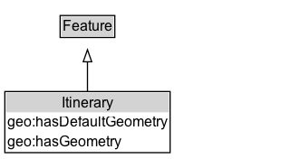

# Itinerary

An ordered set of multiple physically separate features forming a route or itinerary.

## Diagram

=== "SVG (interactive)"

    <!-- Generated by graphviz version 14.1.3 (20260303.0454)
     -->
    <!-- Pages: 1 -->
    <svg width="232pt" height="139pt"
     viewBox="0.00 0.00 232.00 139.00" xmlns="http://www.w3.org/2000/svg" xmlns:xlink="http://www.w3.org/1999/xlink">
    <g id="graph0" class="graph" transform="scale(1 1) rotate(0) translate(4 135.38)">
    <polygon fill="white" stroke="none" points="-4,4 -4,-135.38 228.38,-135.38 228.38,4 -4,4"/>
    <g id="clust3" class="cluster">
    <title>cluster_associated</title>
    </g>
    <!-- Feature -->
    <g id="node1" class="node">
    <title>Feature</title>
    <g id="a_node1"><a xlink:href="../Feature" xlink:title="&lt;TABLE&gt;">
    <polygon fill="lightgray" stroke="none" points="46.75,-105.25 46.75,-121.5 90,-121.5 90,-105.25 46.75,-105.25"/>
    <text xml:space="preserve" text-anchor="start" x="47.75" y="-109.25" font-family="Arial" font-size="12.00">Feature</text>
    <polygon fill="none" stroke="black" points="45.75,-104.25 45.75,-122.5 91,-122.5 91,-104.25 45.75,-104.25"/>
    </a>
    </g>
    </g>
    <!-- Itinerary -->
    <g id="node2" class="node">
    <title>Itinerary</title>
    <g id="a_node2"><a xlink:href="../Itinerary" xlink:title="&lt;TABLE&gt;">
    <polygon fill="lightgray" stroke="none" points="1,-42.12 1,-58.38 135.75,-58.38 135.75,-42.12 1,-42.12"/>
    <text xml:space="preserve" text-anchor="start" x="47" y="-46.12" font-family="Arial" font-size="12.00">Itinerary</text>
    <text xml:space="preserve" text-anchor="start" x="2" y="-29.88" font-family="Arial" font-size="12.00">geo:hasDefaultGeometry</text>
    <text xml:space="preserve" text-anchor="start" x="2" y="-13.62" font-family="Arial" font-size="12.00">geo:hasGeometry</text>
    <polygon fill="none" stroke="black" points="0,-8.62 0,-59.38 136.75,-59.38 136.75,-8.62 0,-8.62"/>
    </a>
    </g>
    </g>
    <!-- Itinerary&#45;&gt;Feature -->
    <g id="edge1" class="edge">
    <title>Itinerary&#45;&gt;Feature</title>
    <path fill="none" stroke="black" d="M68.38,-59.1C68.38,-67.05 68.38,-75.97 68.38,-84.21"/>
    <polygon fill="none" stroke="black" points="64.88,-84.07 68.38,-94.07 71.88,-84.07 64.88,-84.07"/>
    </g>
    <!-- Invis -->
    </g>
    </svg>

=== "PNG"

    

## Formalization for Itinerary

| Property | Constraint |
|----------|------------|
| [geo:hasDefaultGeometry](https://w3id.org/citydata/imported/geo/hasDefaultGeometry) | only [ItineraryGeometry](https://w3id.org/itsdata/location/v1/ItineraryGeometry) |
| [geo:hasGeometry](https://w3id.org/citydata/imported/geo/hasGeometry) | only [ItineraryGeometry](https://w3id.org/itsdata/location/v1/ItineraryGeometry) |
| subClassOf | [Feature](Feature.md) |

