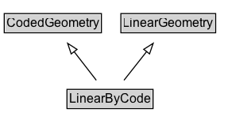

# LinearByCode

A linear geometry whose extent is not modelled here but can be resolved using :hasLookupCode and an external location referencing system.

## Diagram

=== "SVG (interactive)"

    <!-- Generated by graphviz version 14.1.3 (20260303.0454)
     -->
    <!-- Pages: 1 -->
    <svg width="237pt" height="132pt"
     viewBox="0.00 0.00 237.00 132.00" xmlns="http://www.w3.org/2000/svg" xmlns:xlink="http://www.w3.org/1999/xlink">
    <g id="graph0" class="graph" transform="scale(1 1) rotate(0) translate(4 128)">
    <polygon fill="white" stroke="none" points="-4,4 -4,-128 232.88,-128 232.88,4 -4,4"/>
    <g id="clust3" class="cluster">
    <title>cluster_associated</title>
    </g>
    <!-- CodedGeometry -->
    <g id="node1" class="node">
    <title>CodedGeometry</title>
    <g id="a_node1"><a xlink:href="../CodedGeometry" xlink:title="&lt;TABLE&gt;">
    <polygon fill="lightgray" stroke="none" points="1,-97.88 1,-114.12 90.75,-114.12 90.75,-97.88 1,-97.88"/>
    <text xml:space="preserve" text-anchor="start" x="2" y="-101.88" font-family="Arial" font-size="12.00">CodedGeometry</text>
    <polygon fill="none" stroke="black" points="0,-96.88 0,-115.12 91.75,-115.12 91.75,-96.88 0,-96.88"/>
    </a>
    </g>
    </g>
    <!-- LinearGeometry -->
    <g id="node2" class="node">
    <title>LinearGeometry</title>
    <g id="a_node2"><a xlink:href="../LinearGeometry" xlink:title="&lt;TABLE&gt;">
    <polygon fill="lightgray" stroke="none" points="111.12,-97.88 111.12,-114.12 198.62,-114.12 198.62,-97.88 111.12,-97.88"/>
    <text xml:space="preserve" text-anchor="start" x="112.12" y="-101.88" font-family="Arial" font-size="12.00">LinearGeometry</text>
    <polygon fill="none" stroke="black" points="110.12,-96.88 110.12,-115.12 199.62,-115.12 199.62,-96.88 110.12,-96.88"/>
    </a>
    </g>
    </g>
    <!-- LinearByCode -->
    <g id="node3" class="node">
    <title>LinearByCode</title>
    <g id="a_node3"><a xlink:href="../LinearByCode" xlink:title="&lt;TABLE&gt;">
    <polygon fill="lightgray" stroke="none" points="60.25,-25.88 60.25,-42.12 139.5,-42.12 139.5,-25.88 60.25,-25.88"/>
    <text xml:space="preserve" text-anchor="start" x="61.25" y="-29.88" font-family="Arial" font-size="12.00">LinearByCode</text>
    <polygon fill="none" stroke="black" points="59.25,-24.88 59.25,-43.12 140.5,-43.12 140.5,-24.88 59.25,-24.88"/>
    </a>
    </g>
    </g>
    <!-- LinearByCode&#45;&gt;CodedGeometry -->
    <g id="edge1" class="edge">
    <title>LinearByCode&#45;&gt;CodedGeometry</title>
    <path fill="none" stroke="black" d="M86.92,-51.79C80.64,-59.93 72.95,-69.9 65.93,-79"/>
    <polygon fill="none" stroke="black" points="63.21,-76.8 59.87,-86.86 68.75,-81.08 63.21,-76.8"/>
    </g>
    <!-- LinearByCode&#45;&gt;LinearGeometry -->
    <g id="edge2" class="edge">
    <title>LinearByCode&#45;&gt;LinearGeometry</title>
    <path fill="none" stroke="black" d="M113.07,-51.79C119.53,-60.02 127.46,-70.11 134.67,-79.29"/>
    <polygon fill="none" stroke="black" points="131.7,-81.16 140.63,-86.86 137.2,-76.84 131.7,-81.16"/>
    </g>
    <!-- Invis -->
    </g>
    </svg>

=== "PNG"

    

## Formalization for LinearByCode

| Property | Constraint |
|----------|------------|
| subClassOf | [LinearGeometry](LinearGeometry.md) |
| subClassOf | [CodedGeometry](CodedGeometry.md) |

