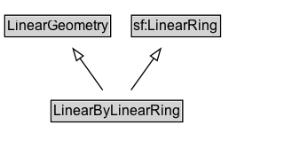

# LinearByLinearRing

A linear geometry encoded as a LinearRing geometry.

## Diagram

=== "SVG (interactive)"

    <!-- Generated by graphviz version 14.1.3 (20260303.0454)
     -->
    <!-- Pages: 1 -->
    <svg width="247pt" height="132pt"
     viewBox="0.00 0.00 247.00 132.00" xmlns="http://www.w3.org/2000/svg" xmlns:xlink="http://www.w3.org/1999/xlink">
    <g id="graph0" class="graph" transform="scale(1 1) rotate(0) translate(4 128)">
    <polygon fill="white" stroke="none" points="-4,4 -4,-128 242.75,-128 242.75,4 -4,4"/>
    <g id="clust3" class="cluster">
    <title>cluster_associated</title>
    </g>
    <!-- LinearGeometry -->
    <g id="node1" class="node">
    <title>LinearGeometry</title>
    <g id="a_node1"><a xlink:href="../LinearGeometry" xlink:title="&lt;TABLE&gt;">
    <polygon fill="lightgray" stroke="none" points="1,-97.88 1,-114.12 88.5,-114.12 88.5,-97.88 1,-97.88"/>
    <text xml:space="preserve" text-anchor="start" x="2" y="-101.88" font-family="Arial" font-size="12.00">LinearGeometry</text>
    <polygon fill="none" stroke="black" points="0,-96.88 0,-115.12 89.5,-115.12 89.5,-96.88 0,-96.88"/>
    </a>
    </g>
    </g>
    <!-- sf_LinearRing -->
    <g id="node2" class="node">
    <title>sf_LinearRing</title>
    <g id="a_node2"><a xlink:href="https://w3id.org/citydata/imported/sf/latest/LinearRing" xlink:title="&lt;TABLE&gt;">
    <polygon fill="lightgray" stroke="none" points="108.12,-97.88 108.12,-114.12 181.38,-114.12 181.38,-97.88 108.12,-97.88"/>
    <text xml:space="preserve" text-anchor="start" x="109.12" y="-101.88" font-family="Arial" font-size="12.00">sf:LinearRing</text>
    <polygon fill="none" stroke="black" points="107.12,-96.88 107.12,-115.12 182.38,-115.12 182.38,-96.88 107.12,-96.88"/>
    </a>
    </g>
    </g>
    <!-- LinearByLinearRing -->
    <g id="node3" class="node">
    <title>LinearByLinearRing</title>
    <g id="a_node3"><a xlink:href="../LinearByLinearRing" xlink:title="&lt;TABLE&gt;">
    <polygon fill="lightgray" stroke="none" points="40.12,-25.88 40.12,-42.12 149.38,-42.12 149.38,-25.88 40.12,-25.88"/>
    <text xml:space="preserve" text-anchor="start" x="41.12" y="-29.88" font-family="Arial" font-size="12.00">LinearByLinearRing</text>
    <polygon fill="none" stroke="black" points="39.12,-24.88 39.12,-43.12 150.38,-43.12 150.38,-24.88 39.12,-24.88"/>
    </a>
    </g>
    </g>
    <!-- LinearByLinearRing&#45;&gt;LinearGeometry -->
    <g id="edge1" class="edge">
    <title>LinearByLinearRing&#45;&gt;LinearGeometry</title>
    <path fill="none" stroke="black" d="M82.76,-51.79C77,-59.85 69.97,-69.69 63.53,-78.71"/>
    <polygon fill="none" stroke="black" points="60.7,-76.65 57.73,-86.82 66.39,-80.72 60.7,-76.65"/>
    </g>
    <!-- LinearByLinearRing&#45;&gt;sf_LinearRing -->
    <g id="edge2" class="edge">
    <title>LinearByLinearRing&#45;&gt;sf_LinearRing</title>
    <path fill="none" stroke="black" d="M106.74,-51.79C112.5,-59.85 119.53,-69.69 125.97,-78.71"/>
    <polygon fill="none" stroke="black" points="123.11,-80.72 131.77,-86.82 128.8,-76.65 123.11,-80.72"/>
    </g>
    <!-- Invis -->
    </g>
    </svg>

=== "PNG"

    

## Formalization for LinearByLinearRing

| Property | Constraint |
|----------|------------|
| subClassOf | [LinearGeometry](LinearGeometry.md) |
| subClassOf | [sf:LinearRing](https://w3id.org/citydata/imported/sf/LinearRing) |

