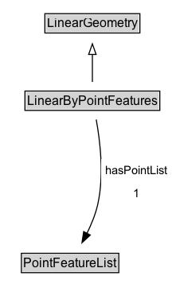

# LinearByPointFeatures

A linear geometry encoded as an ordered sequence of points.

## Diagram

=== "SVG (interactive)"

    <!-- Generated by graphviz version 14.1.3 (20260303.0454)
     -->
    <!-- Pages: 1 -->
    <svg width="166pt" height="286pt"
     viewBox="0.00 0.00 166.00 286.00" xmlns="http://www.w3.org/2000/svg" xmlns:xlink="http://www.w3.org/1999/xlink">
    <g id="graph0" class="graph" transform="scale(1 1) rotate(0) translate(4 282)">
    <polygon fill="white" stroke="none" points="-4,4 -4,-282 161.77,-282 161.77,4 -4,4"/>
    <g id="clust3" class="cluster">
    <title>cluster_associated</title>
    </g>
    <!-- LinearGeometry -->
    <g id="node1" class="node">
    <title>LinearGeometry</title>
    <g id="a_node1"><a xlink:href="../LinearGeometry" xlink:title="&lt;TABLE&gt;">
    <polygon fill="lightgray" stroke="none" points="39.25,-251.88 39.25,-268.12 126.75,-268.12 126.75,-251.88 39.25,-251.88"/>
    <text xml:space="preserve" text-anchor="start" x="40.25" y="-255.88" font-family="Arial" font-size="12.00">LinearGeometry</text>
    <polygon fill="none" stroke="black" points="38.25,-250.88 38.25,-269.12 127.75,-269.12 127.75,-250.88 38.25,-250.88"/>
    </a>
    </g>
    </g>
    <!-- LinearByPointFeatures -->
    <g id="node2" class="node">
    <title>LinearByPointFeatures</title>
    <g id="a_node2"><a xlink:href="../LinearByPointFeatures" xlink:title="&lt;TABLE&gt;">
    <polygon fill="lightgray" stroke="none" points="20.5,-178.88 20.5,-195.12 145.5,-195.12 145.5,-178.88 20.5,-178.88"/>
    <text xml:space="preserve" text-anchor="start" x="21.5" y="-182.88" font-family="Arial" font-size="12.00">LinearByPointFeatures</text>
    <polygon fill="none" stroke="black" points="19.5,-177.88 19.5,-196.12 146.5,-196.12 146.5,-177.88 19.5,-177.88"/>
    </a>
    </g>
    </g>
    <!-- LinearByPointFeatures&#45;&gt;LinearGeometry -->
    <g id="edge1" class="edge">
    <title>LinearByPointFeatures&#45;&gt;LinearGeometry</title>
    <path fill="none" stroke="black" d="M83,-204.71C83,-212.47 83,-221.92 83,-230.74"/>
    <polygon fill="none" stroke="black" points="79.5,-230.66 83,-240.66 86.5,-230.66 79.5,-230.66"/>
    </g>
    <!-- Invis -->
    <!-- LinearByPointFeatures&#45;&gt;Invis -->
    <!-- PointFeatureList -->
    <g id="node4" class="node">
    <title>PointFeatureList</title>
    <g id="a_node4"><a xlink:href="../PointFeatureList" xlink:title="&lt;TABLE&gt;">
    <polygon fill="lightgray" stroke="none" points="17.12,-25.88 17.12,-42.12 106.88,-42.12 106.88,-25.88 17.12,-25.88"/>
    <text xml:space="preserve" text-anchor="start" x="18.12" y="-29.88" font-family="Arial" font-size="12.00">PointFeatureList</text>
    <polygon fill="none" stroke="black" points="16.12,-24.88 16.12,-43.12 107.88,-43.12 107.88,-24.88 16.12,-24.88"/>
    </a>
    </g>
    </g>
    <!-- LinearByPointFeatures&#45;&gt;PointFeatureList -->
    <g id="edge4" class="edge">
    <title>LinearByPointFeatures&#45;&gt;PointFeatureList</title>
    <path fill="none" stroke="black" d="M86.6,-169.29C90.18,-149.76 94.3,-116.62 88,-89 85.88,-79.73 81.96,-70.19 77.8,-61.76"/>
    <polygon fill="black" stroke="black" points="80.99,-60.32 73.22,-53.12 74.81,-63.6 80.99,-60.32"/>
    <polygon fill="white" stroke="none" points="91.27,-89 91.27,-132 157.77,-132 157.77,-89 91.27,-89"/>
    <text xml:space="preserve" text-anchor="start" x="95.27" y="-117.5" font-family="Arial" font-size="11.00">hasPointList</text>
    <text xml:space="preserve" text-anchor="start" x="121.52" y="-96" font-family="Arial" font-size="11.00">1</text>
    </g>
    <!-- Invis&#45;&gt;PointFeatureList -->
    </g>
    </svg>

=== "PNG"

    

## Formalization for LinearByPointFeatures

| Property | Constraint |
|----------|------------|
| [hasPointList](../properties/hasPointList.md) | exactly 1 [PointFeatureList](https://w3id.org/itsdata/location/v1/PointFeatureList) |
| subClassOf | [LinearGeometry](LinearGeometry.md) |

