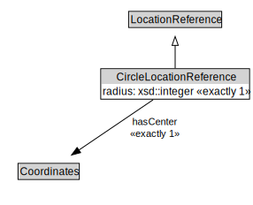

# CircleLocationReference

<a href="../../diagrams/OpenLR__CircleLocationReference.dot.svg">Open interactive CircleLocationReference diagram</a>

## Formalization for CircleLocationReference

| Property | Constraint |
|----------|------------|
| hasCenter | exactly 1 owl::Thing |
| radius | exactly 1 owl::Thing |
| subClassOf | LocationReference |

