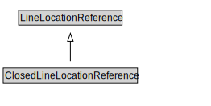

# ClosedLineLocationReference

<a href="../../diagrams/OpenLR__ClosedLineLocationReference.dot.svg">Open interactive ClosedLineLocationReference diagram</a>

## Formalization for ClosedLineLocationReference

| Property | Constraint |
|----------|------------|
| subClassOf | LineLocationReference |

