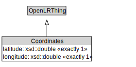

# Coordinates

<a href="../../diagrams/OpenLR__Coordinates.dot.svg">Open interactive Coordinates diagram</a>

## Formalization for Coordinates

| Property | Constraint |
|----------|------------|
| latitude | exactly 1 owl::Thing |
| longitude | exactly 1 owl::Thing |
| subClassOf | OpenLRThing |

