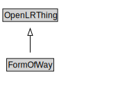

# FormOfWay

<a href="../../diagrams/OpenLR__FormOfWay.dot.svg">Open interactive FormOfWay diagram</a>

## Formalization for FormOfWay

| Property | Constraint |
|----------|------------|
| subClassOf | OpenLRThing |

