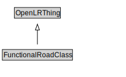

# FunctionalRoadClass

<a href="../../diagrams/OpenLR__FunctionalRoadClass.dot.svg">Open interactive FunctionalRoadClass diagram</a>

## Formalization for FunctionalRoadClass

| Property | Constraint |
|----------|------------|
| subClassOf | OpenLRThing |

