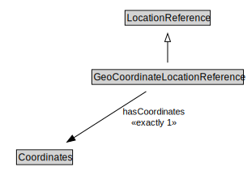

# GeoCoordinateLocationReference

<a href="../../diagrams/OpenLR__GeoCoordinateLocationReference.dot.svg">Open interactive GeoCoordinateLocationReference diagram</a>

## Formalization for GeoCoordinateLocationReference

| Property | Constraint |
|----------|------------|
| hasCoordinates | exactly 1 owl::Thing |
| subClassOf | LocationReference |

