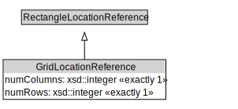

# GridLocationReference

<a href="../../diagrams/OpenLR__GridLocationReference.dot.svg">Open interactive GridLocationReference diagram</a>

## Formalization for GridLocationReference

| Property | Constraint |
|----------|------------|
| numColumns | exactly 1 owl::Thing |
| numRows | exactly 1 owl::Thing |
| subClassOf | RectangleLocationReference |

