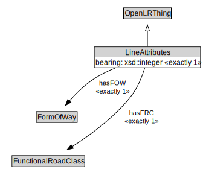

# LineAttributes

<a href="../../diagrams/OpenLR__LineAttributes.dot.svg">Open interactive LineAttributes diagram</a>

## Formalization for LineAttributes

| Property | Constraint |
|----------|------------|
| bearing | exactly 1 owl::Thing |
| hasFOW | exactly 1 owl::Thing |
| hasFRC | exactly 1 owl::Thing |
| subClassOf | OpenLRThing |

