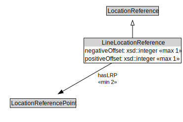

# LineLocationReference

<a href="../../diagrams/OpenLR__LineLocationReference.dot.svg">Open interactive LineLocationReference diagram</a>

## Specializations of LineLocationReference

| Class | Description |
|-------|-------------|
| [Closed Line Location Reference (OpenLR)](OpenLR__ClosedLineLocationReference.md) |  |

## Formalization for LineLocationReference

| Property | Constraint |
|----------|------------|
| hasLRP | min 2 owl::Thing |
| negativeOffset | max 1 owl::Thing |
| positiveOffset | max 1 owl::Thing |
| subClassOf | LocationReference |

