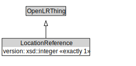

# LocationReference

<a href="../../diagrams/OpenLR__LocationReference.dot.svg">Open interactive LocationReference diagram</a>

## Specializations of LocationReference

| Class | Description |
|-------|-------------|
| [Circle Location Reference (OpenLR)](OpenLR__CircleLocationReference.md) |  |
| [Closed Line Location Reference (OpenLR)](OpenLR__ClosedLineLocationReference.md) |  |
| [Geo Coordinate Location Reference (OpenLR)](OpenLR__GeoCoordinateLocationReference.md) |  |
| [Grid Location Reference (OpenLR)](OpenLR__GridLocationReference.md) |  |
| [Line Location Reference (OpenLR)](OpenLR__LineLocationReference.md) |  |
| [Point Along Line Location Reference (OpenLR)](OpenLR__PointAlongLineLocationReference.md) |  |
| [Poi With Access Point Location Reference (OpenLR)](OpenLR__PoiWithAccessPointLocationReference.md) |  |
| [Polygon Location Reference (OpenLR)](OpenLR__PolygonLocationReference.md) |  |
| [Rectangle Location Reference (OpenLR)](OpenLR__RectangleLocationReference.md) |  |

## Formalization for LocationReference

| Property | Constraint |
|----------|------------|
| subClassOf | OpenLRThing |
| version | exactly 1 owl::Thing |

