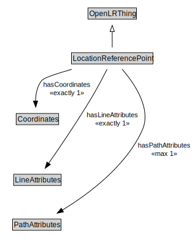

# LocationReferencePoint

<a href="../../diagrams/OpenLR__LocationReferencePoint.dot.svg">Open interactive LocationReferencePoint diagram</a>

## Formalization for LocationReferencePoint

| Property | Constraint |
|----------|------------|
| hasCoordinates | exactly 1 owl::Thing |
| hasLineAttributes | exactly 1 owl::Thing |
| hasPathAttributes | max 1 owl::Thing |
| subClassOf | OpenLRThing |

