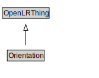

# Orientation

<a href="../../diagrams/OpenLR__Orientation.dot.svg">Open interactive Orientation diagram</a>

## Formalization for Orientation

| Property | Constraint |
|----------|------------|
| subClassOf | OpenLRThing |

