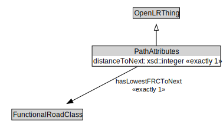

# PathAttributes

<a href="../../diagrams/OpenLR__PathAttributes.dot.svg">Open interactive PathAttributes diagram</a>

## Formalization for PathAttributes

| Property | Constraint |
|----------|------------|
| distanceToNext | exactly 1 owl::Thing |
| hasLowestFRCToNext | exactly 1 owl::Thing |
| subClassOf | OpenLRThing |

