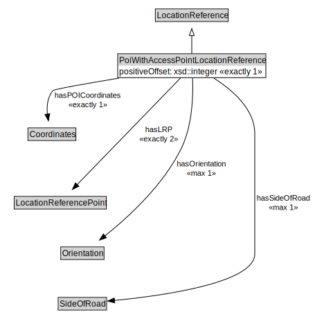

# PoiWithAccessPointLocationReference

<a href="../../diagrams/OpenLR__PoiWithAccessPointLocationReference.dot.svg">Open interactive PoiWithAccessPointLocationReference diagram</a>

## Formalization for PoiWithAccessPointLocationReference

| Property | Constraint |
|----------|------------|
| hasLRP | exactly 2 owl::Thing |
| hasOrientation | max 1 owl::Thing |
| hasPOICoordinates | exactly 1 owl::Thing |
| hasSideOfRoad | max 1 owl::Thing |
| positiveOffset | exactly 1 owl::Thing |
| subClassOf | LocationReference |

