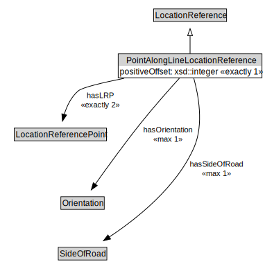

# PointAlongLineLocationReference

<a href="../../diagrams/OpenLR__PointAlongLineLocationReference.dot.svg">Open interactive PointAlongLineLocationReference diagram</a>

## Formalization for PointAlongLineLocationReference

| Property | Constraint |
|----------|------------|
| hasLRP | exactly 2 owl::Thing |
| hasOrientation | max 1 owl::Thing |
| hasSideOfRoad | max 1 owl::Thing |
| positiveOffset | exactly 1 owl::Thing |
| subClassOf | LocationReference |

