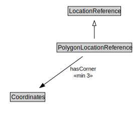

# PolygonLocationReference

<a href="../../diagrams/OpenLR__PolygonLocationReference.dot.svg">Open interactive PolygonLocationReference diagram</a>

## Formalization for PolygonLocationReference

| Property | Constraint |
|----------|------------|
| hasCorner | min 3 owl::Thing |
| subClassOf | LocationReference |

