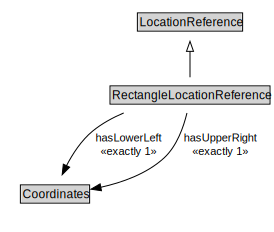

# RectangleLocationReference

<a href="../../diagrams/OpenLR__RectangleLocationReference.dot.svg">Open interactive RectangleLocationReference diagram</a>

## Specializations of RectangleLocationReference

| Class | Description |
|-------|-------------|
| [Grid Location Reference (OpenLR)](OpenLR__GridLocationReference.md) |  |

## Formalization for RectangleLocationReference

| Property | Constraint |
|----------|------------|
| hasLowerLeft | exactly 1 owl::Thing |
| hasUpperRight | exactly 1 owl::Thing |
| subClassOf | LocationReference |

