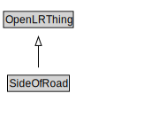

# SideOfRoad

<a href="../../diagrams/OpenLR__SideOfRoad.dot.svg">Open interactive SideOfRoad diagram</a>

## Formalization for SideOfRoad

| Property | Constraint |
|----------|------------|
| subClassOf | OpenLRThing |

