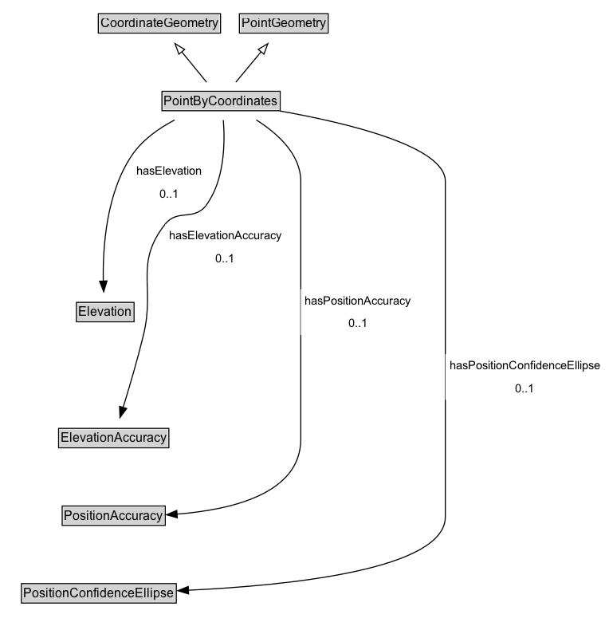

# PointByCoordinates

A coordinate tuple defining the geodetic position of a single point location using a known geodetic reference system

## Diagram

=== "SVG (interactive)"

    <!-- Generated by graphviz version 14.1.3 (20260303.0454)
     -->
    <!-- Pages: 1 -->
    <svg width="573pt" height="596pt"
     viewBox="0.00 0.00 573.00 596.00" xmlns="http://www.w3.org/2000/svg" xmlns:xlink="http://www.w3.org/1999/xlink">
    <g id="graph0" class="graph" transform="scale(1 1) rotate(0) translate(4 592)">
    <polygon fill="white" stroke="none" points="-4,4 -4,-592 568.75,-592 568.75,4 -4,4"/>
    <g id="clust3" class="cluster">
    <title>cluster_associated</title>
    </g>
    <!-- CoordinateGeometry -->
    <g id="node1" class="node">
    <title>CoordinateGeometry</title>
    <g id="a_node1"><a xlink:href="../CoordinateGeometry" xlink:title="&lt;TABLE&gt;">
    <polygon fill="lightgray" stroke="none" points="89.5,-561.88 89.5,-578.12 202.5,-578.12 202.5,-561.88 89.5,-561.88"/>
    <text xml:space="preserve" text-anchor="start" x="90.5" y="-565.88" font-family="Arial" font-size="12.00">CoordinateGeometry</text>
    <polygon fill="none" stroke="black" points="88.5,-560.88 88.5,-579.12 203.5,-579.12 203.5,-560.88 88.5,-560.88"/>
    </a>
    </g>
    </g>
    <!-- PointGeometry -->
    <g id="node2" class="node">
    <title>PointGeometry</title>
    <g id="a_node2"><a xlink:href="../PointGeometry" xlink:title="&lt;TABLE&gt;">
    <polygon fill="lightgray" stroke="none" points="222.25,-561.88 222.25,-578.12 303.75,-578.12 303.75,-561.88 222.25,-561.88"/>
    <text xml:space="preserve" text-anchor="start" x="223.25" y="-565.88" font-family="Arial" font-size="12.00">PointGeometry</text>
    <polygon fill="none" stroke="black" points="221.25,-560.88 221.25,-579.12 304.75,-579.12 304.75,-560.88 221.25,-560.88"/>
    </a>
    </g>
    </g>
    <!-- PointByCoordinates -->
    <g id="node3" class="node">
    <title>PointByCoordinates</title>
    <g id="a_node3"><a xlink:href="../PointByCoordinates" xlink:title="&lt;TABLE&gt;">
    <polygon fill="lightgray" stroke="none" points="149.38,-488.88 149.38,-505.12 258.62,-505.12 258.62,-488.88 149.38,-488.88"/>
    <text xml:space="preserve" text-anchor="start" x="150.38" y="-492.88" font-family="Arial" font-size="12.00">PointByCoordinates</text>
    <polygon fill="none" stroke="black" points="148.38,-487.88 148.38,-506.12 259.62,-506.12 259.62,-487.88 148.38,-487.88"/>
    </a>
    </g>
    </g>
    <!-- PointByCoordinates&#45;&gt;CoordinateGeometry -->
    <g id="edge1" class="edge">
    <title>PointByCoordinates&#45;&gt;CoordinateGeometry</title>
    <path fill="none" stroke="black" d="M190.35,-514.71C183.36,-523.26 174.7,-533.87 166.89,-543.43"/>
    <polygon fill="none" stroke="black" points="164.32,-541.04 160.7,-551 169.74,-545.47 164.32,-541.04"/>
    </g>
    <!-- PointByCoordinates&#45;&gt;PointGeometry -->
    <g id="edge2" class="edge">
    <title>PointByCoordinates&#45;&gt;PointGeometry</title>
    <path fill="none" stroke="black" d="M217.88,-514.71C224.99,-523.26 233.81,-533.87 241.75,-543.43"/>
    <polygon fill="none" stroke="black" points="238.97,-545.56 248.05,-551.01 244.35,-541.08 238.97,-545.56"/>
    </g>
    <!-- Invis -->
    <!-- PointByCoordinates&#45;&gt;Invis -->
    <!-- Elevation -->
    <g id="node5" class="node">
    <title>Elevation</title>
    <g id="a_node5"><a xlink:href="../Elevation" xlink:title="&lt;TABLE&gt;">
    <polygon fill="lightgray" stroke="none" points="68.88,-290.38 68.88,-306.62 121.12,-306.62 121.12,-290.38 68.88,-290.38"/>
    <text xml:space="preserve" text-anchor="start" x="69.88" y="-294.38" font-family="Arial" font-size="12.00">Elevation</text>
    <polygon fill="none" stroke="black" points="67.88,-289.38 67.88,-307.62 122.12,-307.62 122.12,-289.38 67.88,-289.38"/>
    </a>
    </g>
    </g>
    <!-- PointByCoordinates&#45;&gt;Elevation -->
    <g id="edge10" class="edge">
    <title>PointByCoordinates&#45;&gt;Elevation</title>
    <path fill="none" stroke="black" d="M160.3,-479.18C145.5,-471.38 130.26,-460.65 120.5,-446.5 95.96,-410.92 92.58,-359.28 93.2,-327.62"/>
    <polygon fill="black" stroke="black" points="96.69,-327.79 93.56,-317.67 89.7,-327.53 96.69,-327.79"/>
    <polygon fill="white" stroke="none" points="120.5,-399 120.5,-442 190,-442 190,-399 120.5,-399"/>
    <text xml:space="preserve" text-anchor="start" x="124.5" y="-427.5" font-family="Arial" font-size="11.00">hasElevation</text>
    <text xml:space="preserve" text-anchor="start" x="146.25" y="-406" font-family="Arial" font-size="11.00">0..1</text>
    </g>
    <!-- ElevationAccuracy -->
    <g id="node6" class="node">
    <title>ElevationAccuracy</title>
    <g id="a_node6"><a xlink:href="../ElevationAccuracy" xlink:title="&lt;TABLE&gt;">
    <polygon fill="lightgray" stroke="none" points="52.12,-171.88 52.12,-188.12 153.88,-188.12 153.88,-171.88 52.12,-171.88"/>
    <text xml:space="preserve" text-anchor="start" x="53.12" y="-175.88" font-family="Arial" font-size="12.00">ElevationAccuracy</text>
    <polygon fill="none" stroke="black" points="51.12,-170.88 51.12,-189.12 154.88,-189.12 154.88,-170.88 51.12,-170.88"/>
    </a>
    </g>
    </g>
    <!-- PointByCoordinates&#45;&gt;ElevationAccuracy -->
    <g id="edge11" class="edge">
    <title>PointByCoordinates&#45;&gt;ElevationAccuracy</title>
    <path fill="none" stroke="black" d="M206.11,-479.11C207.78,-458.2 207.47,-422.48 190,-399 178.67,-383.76 162.95,-395.95 151.25,-381 122.23,-343.92 142.1,-322.76 131,-277 125.37,-253.81 117.71,-227.84 111.83,-208.77"/>
    <polygon fill="black" stroke="black" points="115.2,-207.82 108.88,-199.31 108.52,-209.9 115.2,-207.82"/>
    <polygon fill="white" stroke="none" points="151.25,-338 151.25,-381 265,-381 265,-338 151.25,-338"/>
    <text xml:space="preserve" text-anchor="start" x="155.25" y="-366.5" font-family="Arial" font-size="11.00">hasElevationAccuracy</text>
    <text xml:space="preserve" text-anchor="start" x="199.12" y="-345" font-family="Arial" font-size="11.00">0..1</text>
    </g>
    <!-- PositionAccuracy -->
    <g id="node7" class="node">
    <title>PositionAccuracy</title>
    <g id="a_node7"><a xlink:href="../PositionAccuracy" xlink:title="&lt;TABLE&gt;">
    <polygon fill="lightgray" stroke="none" points="55.5,-98.88 55.5,-115.12 150.5,-115.12 150.5,-98.88 55.5,-98.88"/>
    <text xml:space="preserve" text-anchor="start" x="56.5" y="-102.88" font-family="Arial" font-size="12.00">PositionAccuracy</text>
    <polygon fill="none" stroke="black" points="54.5,-97.88 54.5,-116.12 151.5,-116.12 151.5,-97.88 54.5,-97.88"/>
    </a>
    </g>
    </g>
    <!-- PointByCoordinates&#45;&gt;PositionAccuracy -->
    <g id="edge8" class="edge">
    <title>PointByCoordinates&#45;&gt;PositionAccuracy</title>
    <path fill="none" stroke="black" d="M237.11,-479.25C257.21,-466.5 279,-446.83 279,-421.5 279,-421.5 279,-421.5 279,-179 279,-127.54 213.49,-112.44 162.4,-108.49"/>
    <polygon fill="black" stroke="black" points="162.8,-105.01 152.6,-107.87 162.36,-112 162.8,-105.01"/>
    <polygon fill="white" stroke="none" points="279,-277 279,-320 386.75,-320 386.75,-277 279,-277"/>
    <text xml:space="preserve" text-anchor="start" x="283" y="-305.5" font-family="Arial" font-size="11.00">hasPositionAccuracy</text>
    <text xml:space="preserve" text-anchor="start" x="323.88" y="-284" font-family="Arial" font-size="11.00">0..1</text>
    </g>
    <!-- PositionConfidenceEllipse -->
    <g id="node8" class="node">
    <title>PositionConfidenceEllipse</title>
    <g id="a_node8"><a xlink:href="../PositionConfidenceEllipse" xlink:title="&lt;TABLE&gt;">
    <polygon fill="lightgray" stroke="none" points="17.12,-25.88 17.12,-42.12 160.88,-42.12 160.88,-25.88 17.12,-25.88"/>
    <text xml:space="preserve" text-anchor="start" x="18.12" y="-29.88" font-family="Arial" font-size="12.00">PositionConfidenceEllipse</text>
    <polygon fill="none" stroke="black" points="16.12,-24.88 16.12,-43.12 161.88,-43.12 161.88,-24.88 16.12,-24.88"/>
    </a>
    </g>
    </g>
    <!-- PointByCoordinates&#45;&gt;PositionConfidenceEllipse -->
    <g id="edge9" class="edge">
    <title>PointByCoordinates&#45;&gt;PositionConfidenceEllipse</title>
    <path fill="none" stroke="black" d="M259.44,-487.61C321.95,-476.54 415,-454.52 415,-421.5 415,-421.5 415,-421.5 415,-106 415,-56.48 269.58,-41.44 172.99,-36.91"/>
    <polygon fill="black" stroke="black" points="173.41,-33.42 163.27,-36.48 173.1,-40.41 173.41,-33.42"/>
    <polygon fill="white" stroke="none" points="415,-216 415,-259 564.75,-259 564.75,-216 415,-216"/>
    <text xml:space="preserve" text-anchor="start" x="419" y="-244.5" font-family="Arial" font-size="11.00">hasPositionConfidenceEllipse</text>
    <text xml:space="preserve" text-anchor="start" x="480.88" y="-223" font-family="Arial" font-size="11.00">0..1</text>
    </g>
    <!-- Invis&#45;&gt;Elevation -->
    <!-- Elevation&#45;&gt;ElevationAccuracy -->
    <!-- ElevationAccuracy&#45;&gt;PositionAccuracy -->
    <!-- PositionAccuracy&#45;&gt;PositionConfidenceEllipse -->
    </g>
    </svg>

=== "PNG"

    

## Specializations of PointByCoordinates

| Class | Description |
|-------|-------------|
| [Point By Geo Coordinates](PointByGeoCoordinates.md) | A point location geometry encoded as latitude/longitude and optional elements, such as elevation and metadata. |
| [Point By Projected Coordinates](PointByProjectedCoordinates.md) | A point location geometry encoded as projected coordinates and optional elements, such as elevation and metadata. |

## Formalization for PointByCoordinates

| Property | Constraint |
|----------|------------|
| [hasElevation](../properties/hasElevation.md) | max 1 [Elevation](https://w3id.org/itsdata/location/v1/Elevation) |
| [hasElevationAccuracy](../properties/hasElevationAccuracy.md) | max 1 [ElevationAccuracy](https://w3id.org/itsdata/location/v1/ElevationAccuracy) |
| [hasPositionAccuracy](../properties/hasPositionAccuracy.md) | max 1 [PositionAccuracy](https://w3id.org/itsdata/location/v1/PositionAccuracy) |
| [hasPositionConfidenceEllipse](../properties/hasPositionConfidenceEllipse.md) | max 1 [PositionConfidenceEllipse](https://w3id.org/itsdata/location/v1/PositionConfidenceEllipse) |
| subClassOf | [PointGeometry](PointGeometry.md) |
| subClassOf | [CoordinateGeometry](CoordinateGeometry.md) |

