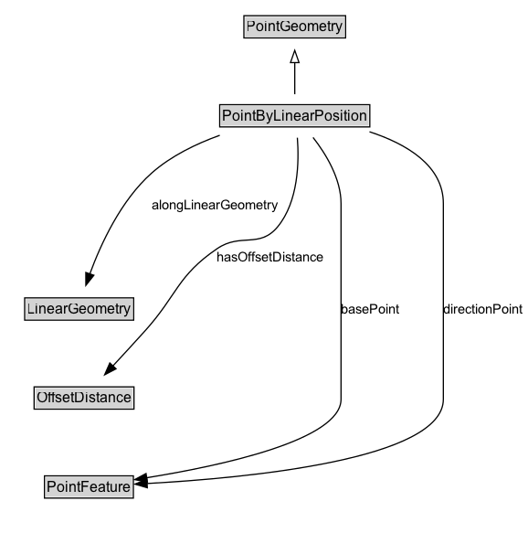

# PointByLinearPosition

A point geometry defined by an offset along a linear geometry.

## Diagram

=== "SVG (interactive)"

    <!-- Generated by graphviz version 14.1.3 (20260303.0454)
     -->
    <!-- Pages: 1 -->
    <svg width="433pt" height="438pt"
     viewBox="0.00 0.00 433.00 438.00" xmlns="http://www.w3.org/2000/svg" xmlns:xlink="http://www.w3.org/1999/xlink">
    <g id="graph0" class="graph" transform="scale(1 1) rotate(0) translate(4 433.5)">
    <polygon fill="white" stroke="none" points="-4,4 -4,-433.5 429.25,-433.5 429.25,4 -4,4"/>
    <g id="clust3" class="cluster">
    <title>cluster_associated</title>
    </g>
    <!-- PointGeometry -->
    <g id="node1" class="node">
    <title>PointGeometry</title>
    <g id="a_node1"><a xlink:href="../PointGeometry" xlink:title="&lt;TABLE&gt;">
    <polygon fill="lightgray" stroke="none" points="197.25,-403.38 197.25,-419.62 278.75,-419.62 278.75,-403.38 197.25,-403.38"/>
    <text xml:space="preserve" text-anchor="start" x="198.25" y="-407.38" font-family="Arial" font-size="12.00">PointGeometry</text>
    <polygon fill="none" stroke="black" points="196.25,-402.38 196.25,-420.62 279.75,-420.62 279.75,-402.38 196.25,-402.38"/>
    </a>
    </g>
    </g>
    <!-- PointByLinearPosition -->
    <g id="node2" class="node">
    <title>PointByLinearPosition</title>
    <g id="a_node2"><a xlink:href="../PointByLinearPosition" xlink:title="&lt;TABLE&gt;">
    <polygon fill="lightgray" stroke="none" points="177.38,-330.38 177.38,-346.62 298.62,-346.62 298.62,-330.38 177.38,-330.38"/>
    <text xml:space="preserve" text-anchor="start" x="178.38" y="-334.38" font-family="Arial" font-size="12.00">PointByLinearPosition</text>
    <polygon fill="none" stroke="black" points="176.38,-329.38 176.38,-347.62 299.62,-347.62 299.62,-329.38 176.38,-329.38"/>
    </a>
    </g>
    </g>
    <!-- PointByLinearPosition&#45;&gt;PointGeometry -->
    <g id="edge1" class="edge">
    <title>PointByLinearPosition&#45;&gt;PointGeometry</title>
    <path fill="none" stroke="black" d="M238,-356.21C238,-363.97 238,-373.42 238,-382.24"/>
    <polygon fill="none" stroke="black" points="234.5,-382.16 238,-392.16 241.5,-382.16 234.5,-382.16"/>
    </g>
    <!-- Invis -->
    <!-- PointByLinearPosition&#45;&gt;Invis -->
    <!-- LinearGeometry -->
    <g id="node4" class="node">
    <title>LinearGeometry</title>
    <g id="a_node4"><a xlink:href="../LinearGeometry" xlink:title="&lt;TABLE&gt;">
    <polygon fill="lightgray" stroke="none" points="17.25,-171.88 17.25,-188.12 104.75,-188.12 104.75,-171.88 17.25,-171.88"/>
    <text xml:space="preserve" text-anchor="start" x="18.25" y="-175.88" font-family="Arial" font-size="12.00">LinearGeometry</text>
    <polygon fill="none" stroke="black" points="16.25,-170.88 16.25,-189.12 105.75,-189.12 105.75,-170.88 16.25,-170.88"/>
    </a>
    </g>
    </g>
    <!-- PointByLinearPosition&#45;&gt;LinearGeometry -->
    <g id="edge6" class="edge">
    <title>PointByLinearPosition&#45;&gt;LinearGeometry</title>
    <path fill="none" stroke="black" d="M176.43,-322.51C156.91,-315.51 136.32,-305.52 120.5,-291.5 95.3,-269.17 78.84,-233.54 69.76,-208.8"/>
    <polygon fill="black" stroke="black" points="73.07,-207.68 66.48,-199.39 66.46,-209.98 73.07,-207.68"/>
    <text xml:space="preserve" text-anchor="middle" x="172.25" y="-261.8" font-family="Arial" font-size="11.00">alongLinearGeometry</text>
    </g>
    <!-- OffsetDistance -->
    <g id="node5" class="node">
    <title>OffsetDistance</title>
    <g id="a_node5"><a xlink:href="../OffsetDistance" xlink:title="&lt;TABLE&gt;">
    <polygon fill="lightgray" stroke="none" points="25,-98.88 25,-115.12 105,-115.12 105,-98.88 25,-98.88"/>
    <text xml:space="preserve" text-anchor="start" x="26" y="-102.88" font-family="Arial" font-size="12.00">OffsetDistance</text>
    <polygon fill="none" stroke="black" points="24,-97.88 24,-116.12 106,-116.12 106,-97.88 24,-97.88"/>
    </a>
    </g>
    </g>
    <!-- PointByLinearPosition&#45;&gt;OffsetDistance -->
    <g id="edge7" class="edge">
    <title>PointByLinearPosition&#45;&gt;OffsetDistance</title>
    <path fill="none" stroke="black" d="M240.13,-320.53C241.65,-300.74 240.99,-268.13 224,-247.5 209.05,-229.35 193.67,-242.75 174.25,-229.5 141.28,-207 141.73,-191.65 115,-162 106.44,-152.51 96.94,-142.19 88.53,-133.14"/>
    <polygon fill="black" stroke="black" points="91.29,-130.96 81.91,-126.03 86.16,-135.73 91.29,-130.96"/>
    <text xml:space="preserve" text-anchor="middle" x="218.12" y="-219.05" font-family="Arial" font-size="11.00">hasOffsetDistance</text>
    </g>
    <!-- PointFeature -->
    <g id="node6" class="node">
    <title>PointFeature</title>
    <g id="a_node6"><a xlink:href="../PointFeature" xlink:title="&lt;TABLE&gt;">
    <polygon fill="lightgray" stroke="none" points="33.5,-25.88 33.5,-42.12 104.5,-42.12 104.5,-25.88 33.5,-25.88"/>
    <text xml:space="preserve" text-anchor="start" x="34.5" y="-29.88" font-family="Arial" font-size="12.00">PointFeature</text>
    <polygon fill="none" stroke="black" points="32.5,-24.88 32.5,-43.12 105.5,-43.12 105.5,-24.88 32.5,-24.88"/>
    </a>
    </g>
    </g>
    <!-- PointByLinearPosition&#45;&gt;PointFeature -->
    <g id="edge8" class="edge">
    <title>PointByLinearPosition&#45;&gt;PointFeature</title>
    <path fill="none" stroke="black" d="M253.02,-320.75C263.64,-307.13 276,-286.91 276,-266.5 276,-266.5 276,-266.5 276,-106 276,-72.45 177.47,-51.4 116.37,-41.57"/>
    <polygon fill="black" stroke="black" points="116.97,-38.12 106.55,-40.04 115.89,-45.04 116.97,-38.12"/>
    <text xml:space="preserve" text-anchor="middle" x="300" y="-176.3" font-family="Arial" font-size="11.00">basePoint</text>
    </g>
    <!-- PointByLinearPosition&#45;&gt;PointFeature -->
    <g id="edge9" class="edge">
    <title>PointByLinearPosition&#45;&gt;PointFeature</title>
    <path fill="none" stroke="black" d="M299.36,-325.41C329.74,-315.48 360,-297.75 360,-266.5 360,-266.5 360,-266.5 360,-106 360,-56.51 199.13,-41.36 116.61,-36.85"/>
    <polygon fill="black" stroke="black" points="116.94,-33.36 106.78,-36.35 116.59,-40.35 116.94,-33.36"/>
    <text xml:space="preserve" text-anchor="middle" x="392.62" y="-176.3" font-family="Arial" font-size="11.00">directionPoint</text>
    </g>
    <!-- Invis&#45;&gt;LinearGeometry -->
    <!-- LinearGeometry&#45;&gt;OffsetDistance -->
    <!-- OffsetDistance&#45;&gt;PointFeature -->
    </g>
    </svg>

=== "PNG"

    

## Formalization for PointByLinearPosition

| Property | Constraint |
|----------|------------|
| [alongLinearGeometry](../properties/alongLinearGeometry.md) | only [LinearGeometry](https://w3id.org/itsdata/location/v1/LinearGeometry) |
| [basePoint](../properties/basePoint.md) | only [PointFeature](https://w3id.org/itsdata/location/v1/PointFeature) |
| [directionPoint](../properties/directionPoint.md) | only [PointFeature](https://w3id.org/itsdata/location/v1/PointFeature) |
| [hasOffsetDistance](../properties/hasOffsetDistance.md) | only [OffsetDistance](https://w3id.org/itsdata/location/v1/OffsetDistance) |
| subClassOf | [PointGeometry](PointGeometry.md) |

