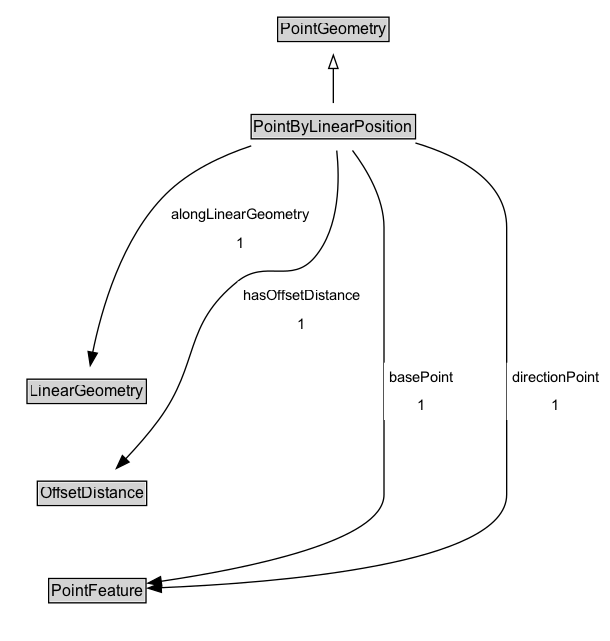

# PointByLinearPosition

A point geometry defined by an offset along a linear geometry.

## Diagram

=== "SVG (interactive)"

    <!-- Generated by graphviz version 14.1.3 (20260303.0454)
     -->
    <!-- Pages: 1 -->
    <svg width="457pt" height="481pt"
     viewBox="0.00 0.00 457.00 481.00" xmlns="http://www.w3.org/2000/svg" xmlns:xlink="http://www.w3.org/1999/xlink">
    <g id="graph0" class="graph" transform="scale(1 1) rotate(0) translate(4 477)">
    <polygon fill="white" stroke="none" points="-4,4 -4,-477 453.25,-477 453.25,4 -4,4"/>
    <g id="clust3" class="cluster">
    <title>cluster_associated</title>
    </g>
    <!-- PointGeometry -->
    <g id="node1" class="node">
    <title>PointGeometry</title>
    <g id="a_node1"><a xlink:href="../PointGeometry" xlink:title="&lt;TABLE&gt;">
    <polygon fill="lightgray" stroke="none" points="205.25,-446.88 205.25,-463.12 286.75,-463.12 286.75,-446.88 205.25,-446.88"/>
    <text xml:space="preserve" text-anchor="start" x="206.25" y="-450.88" font-family="Arial" font-size="12.00">PointGeometry</text>
    <polygon fill="none" stroke="black" points="204.25,-445.88 204.25,-464.12 287.75,-464.12 287.75,-445.88 204.25,-445.88"/>
    </a>
    </g>
    </g>
    <!-- PointByLinearPosition -->
    <g id="node2" class="node">
    <title>PointByLinearPosition</title>
    <g id="a_node2"><a xlink:href="../PointByLinearPosition" xlink:title="&lt;TABLE&gt;">
    <polygon fill="lightgray" stroke="none" points="185.38,-373.88 185.38,-390.12 306.62,-390.12 306.62,-373.88 185.38,-373.88"/>
    <text xml:space="preserve" text-anchor="start" x="186.38" y="-377.88" font-family="Arial" font-size="12.00">PointByLinearPosition</text>
    <polygon fill="none" stroke="black" points="184.38,-372.88 184.38,-391.12 307.62,-391.12 307.62,-372.88 184.38,-372.88"/>
    </a>
    </g>
    </g>
    <!-- PointByLinearPosition&#45;&gt;PointGeometry -->
    <g id="edge1" class="edge">
    <title>PointByLinearPosition&#45;&gt;PointGeometry</title>
    <path fill="none" stroke="black" d="M246,-399.71C246,-407.47 246,-416.92 246,-425.74"/>
    <polygon fill="none" stroke="black" points="242.5,-425.66 246,-435.66 249.5,-425.66 242.5,-425.66"/>
    </g>
    <!-- Invis -->
    <!-- PointByLinearPosition&#45;&gt;Invis -->
    <!-- LinearGeometry -->
    <g id="node4" class="node">
    <title>LinearGeometry</title>
    <g id="a_node4"><a xlink:href="../LinearGeometry" xlink:title="&lt;TABLE&gt;">
    <polygon fill="lightgray" stroke="none" points="17.25,-175.38 17.25,-191.62 104.75,-191.62 104.75,-175.38 17.25,-175.38"/>
    <text xml:space="preserve" text-anchor="start" x="18.25" y="-179.38" font-family="Arial" font-size="12.00">LinearGeometry</text>
    <polygon fill="none" stroke="black" points="16.25,-174.38 16.25,-192.62 105.75,-192.62 105.75,-174.38 16.25,-174.38"/>
    </a>
    </g>
    </g>
    <!-- PointByLinearPosition&#45;&gt;LinearGeometry -->
    <g id="edge6" class="edge">
    <title>PointByLinearPosition&#45;&gt;LinearGeometry</title>
    <path fill="none" stroke="black" d="M184.43,-367.61C161.99,-360.14 137.88,-348.73 120.5,-331.5 87.41,-298.7 72.07,-245.04 65.47,-212.42"/>
    <polygon fill="black" stroke="black" points="68.97,-212.11 63.69,-202.92 62.09,-213.39 68.97,-212.11"/>
    <polygon fill="white" stroke="none" points="120.5,-284 120.5,-327 232,-327 232,-284 120.5,-284"/>
    <text xml:space="preserve" text-anchor="start" x="124.5" y="-312.5" font-family="Arial" font-size="11.00">alongLinearGeometry</text>
    <text xml:space="preserve" text-anchor="start" x="173.25" y="-291" font-family="Arial" font-size="11.00">1</text>
    </g>
    <!-- OffsetDistance -->
    <g id="node5" class="node">
    <title>OffsetDistance</title>
    <g id="a_node5"><a xlink:href="../OffsetDistance" xlink:title="&lt;TABLE&gt;">
    <polygon fill="lightgray" stroke="none" points="25,-98.88 25,-115.12 105,-115.12 105,-98.88 25,-98.88"/>
    <text xml:space="preserve" text-anchor="start" x="26" y="-102.88" font-family="Arial" font-size="12.00">OffsetDistance</text>
    <polygon fill="none" stroke="black" points="24,-97.88 24,-116.12 106,-116.12 106,-97.88 24,-97.88"/>
    </a>
    </g>
    </g>
    <!-- PointByLinearPosition&#45;&gt;OffsetDistance -->
    <g id="edge7" class="edge">
    <title>PointByLinearPosition&#45;&gt;OffsetDistance</title>
    <path fill="none" stroke="black" d="M248.56,-364.09C250.78,-342.82 251.1,-306.4 232,-284 214.56,-263.54 195.2,-282.85 174.25,-266 132.8,-232.65 146.44,-204.91 115,-162 107.56,-151.85 98.44,-141.51 90.04,-132.64"/>
    <polygon fill="black" stroke="black" points="92.81,-130.46 83.33,-125.72 87.78,-135.33 92.81,-130.46"/>
    <polygon fill="white" stroke="none" points="174.25,-223 174.25,-266 270,-266 270,-223 174.25,-223"/>
    <text xml:space="preserve" text-anchor="start" x="178.25" y="-251.5" font-family="Arial" font-size="11.00">hasOffsetDistance</text>
    <text xml:space="preserve" text-anchor="start" x="219.12" y="-230" font-family="Arial" font-size="11.00">1</text>
    </g>
    <!-- PointFeature -->
    <g id="node6" class="node">
    <title>PointFeature</title>
    <g id="a_node6"><a xlink:href="../PointFeature" xlink:title="&lt;TABLE&gt;">
    <polygon fill="lightgray" stroke="none" points="33.5,-25.88 33.5,-42.12 104.5,-42.12 104.5,-25.88 33.5,-25.88"/>
    <text xml:space="preserve" text-anchor="start" x="34.5" y="-29.88" font-family="Arial" font-size="12.00">PointFeature</text>
    <polygon fill="none" stroke="black" points="32.5,-24.88 32.5,-43.12 105.5,-43.12 105.5,-24.88 32.5,-24.88"/>
    </a>
    </g>
    </g>
    <!-- PointByLinearPosition&#45;&gt;PointFeature -->
    <g id="edge8" class="edge">
    <title>PointByLinearPosition&#45;&gt;PointFeature</title>
    <path fill="none" stroke="black" d="M260.37,-364.17C271.13,-349.82 284,-328.13 284,-306.5 284,-306.5 284,-306.5 284,-106 284,-71.03 180.14,-50.37 116.79,-41.03"/>
    <polygon fill="black" stroke="black" points="117.36,-37.57 106.97,-39.62 116.38,-44.5 117.36,-37.57"/>
    <polygon fill="white" stroke="none" points="284,-162 284,-205 340,-205 340,-162 284,-162"/>
    <text xml:space="preserve" text-anchor="start" x="288" y="-190.5" font-family="Arial" font-size="11.00">basePoint</text>
    <text xml:space="preserve" text-anchor="start" x="309" y="-169" font-family="Arial" font-size="11.00">1</text>
    </g>
    <!-- PointByLinearPosition&#45;&gt;PointFeature -->
    <g id="edge9" class="edge">
    <title>PointByLinearPosition&#45;&gt;PointFeature</title>
    <path fill="none" stroke="black" d="M307.57,-369.78C341.17,-359.71 376,-340.97 376,-306.5 376,-306.5 376,-306.5 376,-106 376,-53.44 203.01,-39.78 116.74,-36.24"/>
    <polygon fill="black" stroke="black" points="117.06,-32.75 106.93,-35.87 116.8,-39.74 117.06,-32.75"/>
    <polygon fill="white" stroke="none" points="376,-162 376,-205 449.25,-205 449.25,-162 376,-162"/>
    <text xml:space="preserve" text-anchor="start" x="380" y="-190.5" font-family="Arial" font-size="11.00">directionPoint</text>
    <text xml:space="preserve" text-anchor="start" x="409.62" y="-169" font-family="Arial" font-size="11.00">1</text>
    </g>
    <!-- Invis&#45;&gt;LinearGeometry -->
    <!-- LinearGeometry&#45;&gt;OffsetDistance -->
    <!-- OffsetDistance&#45;&gt;PointFeature -->
    </g>
    </svg>

=== "PNG"

    

## Formalization for PointByLinearPosition

| Property | Constraint |
|----------|------------|
| [alongLinearGeometry](../properties/alongLinearGeometry.md) | exactly 1 [LinearGeometry](https://w3id.org/itsdata/location/v1/LinearGeometry) |
| [basePoint](../properties/basePoint.md) | exactly 1 [PointFeature](https://w3id.org/itsdata/location/v1/PointFeature) |
| [directionPoint](../properties/directionPoint.md) | exactly 1 [PointFeature](https://w3id.org/itsdata/location/v1/PointFeature) |
| [hasOffsetDistance](../properties/hasOffsetDistance.md) | exactly 1 [OffsetDistance](https://w3id.org/itsdata/location/v1/OffsetDistance) |
| subClassOf | [PointGeometry](PointGeometry.md) |

