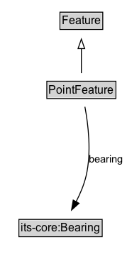

# PointFeature

A spatial feature with no length in any of the spatial dimensions (a point phenomenon in space).

## Diagram

=== "SVG (interactive)"

    <!-- Generated by graphviz version 14.1.3 (20260303.0454)
     -->
    <!-- Pages: 1 -->
    <svg width="134pt" height="279pt"
     viewBox="0.00 0.00 134.00 279.00" xmlns="http://www.w3.org/2000/svg" xmlns:xlink="http://www.w3.org/1999/xlink">
    <g id="graph0" class="graph" transform="scale(1 1) rotate(0) translate(4 275)">
    <polygon fill="white" stroke="none" points="-4,4 -4,-275 130.1,-275 130.1,4 -4,4"/>
    <g id="clust3" class="cluster">
    <title>cluster_associated</title>
    </g>
    <!-- Feature -->
    <g id="node1" class="node">
    <title>Feature</title>
    <g id="a_node1"><a xlink:href="../Feature" xlink:title="&lt;TABLE&gt;">
    <polygon fill="lightgray" stroke="none" points="60.38,-244.88 60.38,-261.12 103.62,-261.12 103.62,-244.88 60.38,-244.88"/>
    <text xml:space="preserve" text-anchor="start" x="61.38" y="-248.88" font-family="Arial" font-size="12.00">Feature</text>
    <polygon fill="none" stroke="black" points="59.38,-243.88 59.38,-262.12 104.62,-262.12 104.62,-243.88 59.38,-243.88"/>
    </a>
    </g>
    </g>
    <!-- PointFeature -->
    <g id="node2" class="node">
    <title>PointFeature</title>
    <g id="a_node2"><a xlink:href="../PointFeature" xlink:title="&lt;TABLE&gt;">
    <polygon fill="lightgray" stroke="none" points="46.5,-171.88 46.5,-188.12 117.5,-188.12 117.5,-171.88 46.5,-171.88"/>
    <text xml:space="preserve" text-anchor="start" x="47.5" y="-175.88" font-family="Arial" font-size="12.00">PointFeature</text>
    <polygon fill="none" stroke="black" points="45.5,-170.88 45.5,-189.12 118.5,-189.12 118.5,-170.88 45.5,-170.88"/>
    </a>
    </g>
    </g>
    <!-- PointFeature&#45;&gt;Feature -->
    <g id="edge1" class="edge">
    <title>PointFeature&#45;&gt;Feature</title>
    <path fill="none" stroke="black" d="M82,-197.71C82,-205.47 82,-214.92 82,-223.74"/>
    <polygon fill="none" stroke="black" points="78.5,-223.66 82,-233.66 85.5,-223.66 78.5,-223.66"/>
    </g>
    <!-- Invis -->
    <!-- PointFeature&#45;&gt;Invis -->
    <!-- its&#45;core_Bearing -->
    <g id="node4" class="node">
    <title>its&#45;core_Bearing</title>
    <g id="a_node4"><a xlink:href="https://w3id.org/itsdata/core/v1/Bearing" xlink:title="&lt;TABLE&gt;">
    <polygon fill="lightgray" stroke="none" points="17,-25.88 17,-42.12 103,-42.12 103,-25.88 17,-25.88"/>
    <text xml:space="preserve" text-anchor="start" x="18" y="-29.88" font-family="Arial" font-size="12.00">its&#45;core:Bearing</text>
    <polygon fill="none" stroke="black" points="16,-24.88 16,-43.12 104,-43.12 104,-24.88 16,-24.88"/>
    </a>
    </g>
    </g>
    <!-- PointFeature&#45;&gt;its&#45;core_Bearing -->
    <g id="edge4" class="edge">
    <title>PointFeature&#45;&gt;its&#45;core_Bearing</title>
    <path fill="none" stroke="black" d="M85.76,-162.16C89.19,-143.89 92.9,-113.98 87,-89 84.8,-79.68 80.73,-70.13 76.4,-61.7"/>
    <polygon fill="black" stroke="black" points="79.53,-60.12 71.64,-53.06 73.4,-63.5 79.53,-60.12"/>
    <text xml:space="preserve" text-anchor="middle" x="108.1" y="-103.3" font-family="Arial" font-size="11.00">bearing</text>
    </g>
    <!-- Invis&#45;&gt;its&#45;core_Bearing -->
    </g>
    </svg>

=== "PNG"

    

## Formalization for PointFeature

| Property | Constraint |
|----------|------------|
| [bearing](../properties/bearing.md) | only [its-core:Bearing](https://w3id.org/itsdata/core/v1/Bearing) |
| subClassOf | [Feature](Feature.md) |

