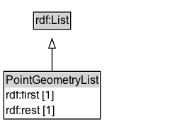

# PointGeometryList

An ordered list of member point geometries.

## Diagram

=== "SVG (interactive)"

    <!-- Generated by graphviz version 14.1.3 (20260303.0454)
     -->
    <!-- Pages: 1 -->
    <svg width="198pt" height="139pt"
     viewBox="0.00 0.00 198.00 139.00" xmlns="http://www.w3.org/2000/svg" xmlns:xlink="http://www.w3.org/1999/xlink">
    <g id="graph0" class="graph" transform="scale(1 1) rotate(0) translate(4 135.38)">
    <polygon fill="white" stroke="none" points="-4,4 -4,-135.38 194.12,-135.38 194.12,4 -4,4"/>
    <g id="clust3" class="cluster">
    <title>cluster_associated</title>
    </g>
    <!-- rdf_List -->
    <g id="node1" class="node">
    <title>rdf_List</title>
    <g id="a_node1"><a xlink:href="https://w3id.org/citydata/imported/rdf/latest/List" xlink:title="&lt;TABLE&gt;">
    <polygon fill="lightgray" stroke="none" points="32.5,-105.25 32.5,-121.5 69.75,-121.5 69.75,-105.25 32.5,-105.25"/>
    <text xml:space="preserve" text-anchor="start" x="33.5" y="-109.25" font-family="Arial" font-size="12.00">rdf:List</text>
    <polygon fill="none" stroke="black" points="31.5,-104.25 31.5,-122.5 70.75,-122.5 70.75,-104.25 31.5,-104.25"/>
    </a>
    </g>
    </g>
    <!-- PointGeometryList -->
    <g id="node2" class="node">
    <title>PointGeometryList</title>
    <g id="a_node2"><a xlink:href="../PointGeometryList" xlink:title="&lt;TABLE&gt;">
    <polygon fill="lightgray" stroke="none" points="1,-42.12 1,-58.38 101.25,-58.38 101.25,-42.12 1,-42.12"/>
    <text xml:space="preserve" text-anchor="start" x="2" y="-46.12" font-family="Arial" font-size="12.00">PointGeometryList</text>
    <text xml:space="preserve" text-anchor="start" x="2" y="-29.88" font-family="Arial" font-size="12.00">rdf:first [1]</text>
    <text xml:space="preserve" text-anchor="start" x="2" y="-13.62" font-family="Arial" font-size="12.00">rdf:rest [1]</text>
    <polygon fill="none" stroke="black" points="0,-8.62 0,-59.38 102.25,-59.38 102.25,-8.62 0,-8.62"/>
    </a>
    </g>
    </g>
    <!-- PointGeometryList&#45;&gt;rdf_List -->
    <g id="edge1" class="edge">
    <title>PointGeometryList&#45;&gt;rdf_List</title>
    <path fill="none" stroke="black" d="M51.12,-59.1C51.12,-67.05 51.12,-75.97 51.12,-84.21"/>
    <polygon fill="none" stroke="black" points="47.63,-84.07 51.13,-94.07 54.63,-84.07 47.63,-84.07"/>
    </g>
    <!-- Invis -->
    </g>
    </svg>

=== "PNG"

    

## Formalization for PointGeometryList

| Property | Constraint |
|----------|------------|
| [rdf:first](https://w3id.org/citydata/imported/rdf/first) | exactly 1 [PointGeometry](https://w3id.org/itsdata/location/v1/PointGeometry) |
| [rdf:rest](https://w3id.org/citydata/imported/rdf/rest) | exactly 1 |
| subClassOf | [rdf:List](https://w3id.org/citydata/imported/rdf/List) |

