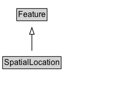

# SpatialLocation

A location that is represented in three-dimensional space.

NOTE: The 'location' could be a point (consuming no space) or could consume space in one, two or three dimensions. In any case, the location is identified within a larger space.

## Diagram

=== "SVG (interactive)"

    <!-- Generated by graphviz version 14.1.3 (20260303.0454)
     -->
    <!-- Pages: 1 -->
    <svg width="184pt" height="132pt"
     viewBox="0.00 0.00 184.00 132.00" xmlns="http://www.w3.org/2000/svg" xmlns:xlink="http://www.w3.org/1999/xlink">
    <g id="graph0" class="graph" transform="scale(1 1) rotate(0) translate(4 128)">
    <polygon fill="white" stroke="none" points="-4,4 -4,-128 179.62,-128 179.62,4 -4,4"/>
    <g id="clust3" class="cluster">
    <title>cluster_associated</title>
    </g>
    <!-- Feature -->
    <g id="node1" class="node">
    <title>Feature</title>
    <g id="a_node1"><a xlink:href="../Feature" xlink:title="&lt;TABLE&gt;">
    <polygon fill="lightgray" stroke="none" points="22,-97.88 22,-114.12 65.25,-114.12 65.25,-97.88 22,-97.88"/>
    <text xml:space="preserve" text-anchor="start" x="23" y="-101.88" font-family="Arial" font-size="12.00">Feature</text>
    <polygon fill="none" stroke="black" points="21,-96.88 21,-115.12 66.25,-115.12 66.25,-96.88 21,-96.88"/>
    </a>
    </g>
    </g>
    <!-- SpatialLocation -->
    <g id="node2" class="node">
    <title>SpatialLocation</title>
    <g id="a_node2"><a xlink:href="../SpatialLocation" xlink:title="&lt;TABLE&gt;">
    <polygon fill="lightgray" stroke="none" points="1,-25.88 1,-42.12 86.25,-42.12 86.25,-25.88 1,-25.88"/>
    <text xml:space="preserve" text-anchor="start" x="2" y="-29.88" font-family="Arial" font-size="12.00">SpatialLocation</text>
    <polygon fill="none" stroke="black" points="0,-24.88 0,-43.12 87.25,-43.12 87.25,-24.88 0,-24.88"/>
    </a>
    </g>
    </g>
    <!-- SpatialLocation&#45;&gt;Feature -->
    <g id="edge1" class="edge">
    <title>SpatialLocation&#45;&gt;Feature</title>
    <path fill="none" stroke="black" d="M43.62,-51.79C43.62,-59.25 43.62,-68.24 43.62,-76.69"/>
    <polygon fill="none" stroke="black" points="40.13,-76.54 43.63,-86.54 47.13,-76.54 40.13,-76.54"/>
    </g>
    <!-- Invis -->
    </g>
    </svg>

=== "PNG"

    

## Formalization for SpatialLocation

| Property | Constraint |
|----------|------------|
| subClassOf | [Feature](Feature.md) |

