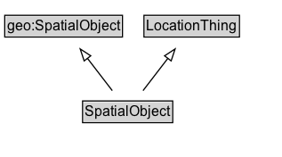

# SpatialObject

A spatial object within the ITS domain (subclass of geo:SpatialObject).

## Diagram

=== "SVG (interactive)"

    <!-- Generated by graphviz version 14.1.3 (20260303.0454)
     -->
    <!-- Pages: 1 -->
    <svg width="238pt" height="132pt"
     viewBox="0.00 0.00 238.00 132.00" xmlns="http://www.w3.org/2000/svg" xmlns:xlink="http://www.w3.org/1999/xlink">
    <g id="graph0" class="graph" transform="scale(1 1) rotate(0) translate(4 128)">
    <polygon fill="white" stroke="none" points="-4,4 -4,-128 233.62,-128 233.62,4 -4,4"/>
    <g id="clust3" class="cluster">
    <title>cluster_associated</title>
    </g>
    <!-- geo_SpatialObject -->
    <g id="node1" class="node">
    <title>geo_SpatialObject</title>
    <g id="a_node1"><a xlink:href="https://w3id.org/citydata/imported/geo/latest/SpatialObject" xlink:title="&lt;TABLE&gt;">
    <polygon fill="lightgray" stroke="none" points="1,-97.88 1,-114.12 98.25,-114.12 98.25,-97.88 1,-97.88"/>
    <text xml:space="preserve" text-anchor="start" x="2" y="-101.88" font-family="Arial" font-size="12.00">geo:SpatialObject</text>
    <polygon fill="none" stroke="black" points="0,-96.88 0,-115.12 99.25,-115.12 99.25,-96.88 0,-96.88"/>
    </a>
    </g>
    </g>
    <!-- LocationThing -->
    <g id="node2" class="node">
    <title>LocationThing</title>
    <g id="a_node2"><a xlink:href="../LocationThing" xlink:title="&lt;TABLE&gt;">
    <polygon fill="lightgray" stroke="none" points="118.38,-97.88 118.38,-114.12 196.88,-114.12 196.88,-97.88 118.38,-97.88"/>
    <text xml:space="preserve" text-anchor="start" x="119.38" y="-101.88" font-family="Arial" font-size="12.00">LocationThing</text>
    <polygon fill="none" stroke="black" points="117.38,-96.88 117.38,-115.12 197.88,-115.12 197.88,-96.88 117.38,-96.88"/>
    </a>
    </g>
    </g>
    <!-- SpatialObject -->
    <g id="node3" class="node">
    <title>SpatialObject</title>
    <g id="a_node3"><a xlink:href="../SpatialObject" xlink:title="&lt;TABLE&gt;">
    <polygon fill="lightgray" stroke="none" points="66.62,-25.88 66.62,-42.12 140.62,-42.12 140.62,-25.88 66.62,-25.88"/>
    <text xml:space="preserve" text-anchor="start" x="67.62" y="-29.88" font-family="Arial" font-size="12.00">SpatialObject</text>
    <polygon fill="none" stroke="black" points="65.62,-24.88 65.62,-43.12 141.62,-43.12 141.62,-24.88 65.62,-24.88"/>
    </a>
    </g>
    </g>
    <!-- SpatialObject&#45;&gt;geo_SpatialObject -->
    <g id="edge1" class="edge">
    <title>SpatialObject&#45;&gt;geo_SpatialObject</title>
    <path fill="none" stroke="black" d="M90.67,-51.79C84.39,-59.93 76.7,-69.9 69.68,-79"/>
    <polygon fill="none" stroke="black" points="66.96,-76.8 63.62,-86.86 72.5,-81.08 66.96,-76.8"/>
    </g>
    <!-- SpatialObject&#45;&gt;LocationThing -->
    <g id="edge2" class="edge">
    <title>SpatialObject&#45;&gt;LocationThing</title>
    <path fill="none" stroke="black" d="M116.58,-51.79C122.86,-59.93 130.55,-69.9 137.57,-79"/>
    <polygon fill="none" stroke="black" points="134.75,-81.08 143.63,-86.86 140.29,-76.8 134.75,-81.08"/>
    </g>
    <!-- Invis -->
    </g>
    </svg>

=== "PNG"

    

## Specializations of SpatialObject

| Class | Description |
|-------|-------------|
| [Area By Circle](AreaByCircle.md) | An area geometry encoded as a circle. |
| [Area By Code](AreaByCode.md) | An area geometry whose extent is not modelled here but can be resolved using :hasLookupCode and an external location referencing system. |
| [Area By Code](AreaByCode.md) | An area geometry whose extent is not modelled here but can be resolved using :hasLookupCode and an external location referencing system. |
| [Area By Grid](AreaByGrid.md) | An area geometry encoded as a grid. The rectangle defined by lower-left and upper-right is the base cell, which is replicated eastward (columns) and northward (rows). |
| [Area By Grid](AreaByGrid.md) | An area geometry encoded as a grid. The rectangle defined by lower-left and upper-right is the base cell, which is replicated eastward (columns) and northward (rows). |
| [Area By Linear Boundaries](AreaByLinearBoundaries.md) | An area geometry encoded as a set of linear boundary geometries. |
| [Area By Multi Polygon](AreaByMultiPolygon.md) | An area geometry encoded as a MultiPolygon geometry. |
| [Area By Polygon](AreaByPolygon.md) | An area geometry encoded as a Polygon geometry. |
| [Area By Rectangle](AreaByRectangle.md) | An area geometry encoded as a rectangle, defined by a lower-left corner and an upper-right corner. |
| [Area Feature](AreaFeature.md) | A spatial feature enclosed within a two-dimensional boundary or boundaries across a defined surface. |
| [Area Geometry](AreaGeometry.md) | A geometry that encodes an area location using a specific method. |
| [Coded Geometry](CodedGeometry.md) | A geometry whose extent is resolved via an external code, registry, or service (a pointer to a geometry held elsewhere). |
| [Coordinate Geometry](CoordinateGeometry.md) | A geometry that is represented by a coordinate system (i.e., directly encodes coordinate tuples). |
| [Feature](Feature.md) | An abstraction of real-world phenomena. An ITS-domain feature (subclass of geo:Feature) used to model real-world things that have a spatial location. |
| [Geometry](Geometry.md) | A description of a spatial location in the real world according to a defined reference system. |
| [Itinerary](Itinerary.md) | An ordered set of multiple physically separate features forming a route or itinerary. |
| [Itinerary By Waypoints](ItineraryByWaypoints.md) | An itinerary geometry encoded as an ordered sequence of features (waypoints). |
| [Itinerary Code](ItineraryCode.md) | An itinerary geometry whose route geometry is not modelled here but can be resolved using :hasLookupCode and an external itinerary/route referencing system. |
| [Itinerary Code](ItineraryCode.md) | An itinerary geometry whose route geometry is not modelled here but can be resolved using :hasLookupCode and an external itinerary/route referencing system. |
| [Itinerary Geometry](ItineraryGeometry.md) | A geometry that encodes an itinerary using a specific method. |
| [Linear By Code](LinearByCode.md) | A linear geometry whose extent is not modelled here but can be resolved using :hasLookupCode and an external location referencing system. |
| [Linear By Code](LinearByCode.md) | A linear geometry whose extent is not modelled here but can be resolved using :hasLookupCode and an external location referencing system. |
| [Linear By Linear Ring](LinearByLinearRing.md) | A linear geometry encoded as a LinearRing geometry. |
| [Linear By Line String](LinearByLineString.md) | A linear geometry encoded as a LineString geometry. |
| [Linear By Multi Line String](LinearByMultiLineString.md) | A linear geometry encoded as a MultiLineString geometry. |
| [Linear By Point Features](LinearByPointFeatures.md) | A linear geometry encoded as an ordered sequence of points. |
| [Linear By Point Geometries](LinearByPointGeometries.md) | A linear geometry encoded as an ordered sequence of point geometries. |
| [Linear Feature](LinearFeature.md) | A spatial feature that extends along a defined path (typically between two point features or along a network element). |
| [Linear Geometry](LinearGeometry.md) | A geometry that encodes a linear location using a specific method. |
| [Location Group](LocationGroup.md) | An unordered set of multiple physically separate features (each typically a singular feature with its own geometry). |
| [Point By Code](PointByCode.md) | A point geometry whose coordinates are not modelled here but can be resolved using :hasLookupCode and an external location referencing system. |
| [Point By Code](PointByCode.md) | A point geometry whose coordinates are not modelled here but can be resolved using :hasLookupCode and an external location referencing system. |
| [Point By Coordinates](PointByCoordinates.md) | A coordinate tuple defining the geodetic position of a single point location using a known geodetic reference system |
| [Point By Coordinates](PointByCoordinates.md) | A coordinate tuple defining the geodetic position of a single point location using a known geodetic reference system |
| [Point By Geo Coordinates](PointByGeoCoordinates.md) | A point location geometry encoded as latitude/longitude and optional elements, such as elevation and metadata. |
| [Point By Linear Position](PointByLinearPosition.md) | A point geometry defined by an offset along a linear geometry. |
| [Point By Projected Coordinates](PointByProjectedCoordinates.md) | A point location geometry encoded as projected coordinates and optional elements, such as elevation and metadata. |
| [Point Feature](PointFeature.md) | A spatial feature with no length in any of the spatial dimensions (a point phenomenon in space). |
| [Point Geometry](PointGeometry.md) | A geometry for a point location using a specific method (e.g., coordinates or an external code). |

## Formalization for SpatialObject

| Property | Constraint |
|----------|------------|
| subClassOf | [LocationThing](LocationThing.md) |
| subClassOf | [geo:SpatialObject](https://w3id.org/citydata/imported/geo/SpatialObject) |

