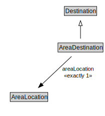

# AreaDestination

<a href="../../diagrams/itsLocation__AreaDestination.dot.svg">Open interactive AreaDestination diagram</a>

## Formalization for AreaDestination

| Property | Constraint |
|----------|------------|
| areaLocation | exactly 1 owl::Thing |
| subClassOf | Destination |

## Other annotations

| Annotation | Value |
|------------|-------|
| xsd::pattern | LocationPattern |

