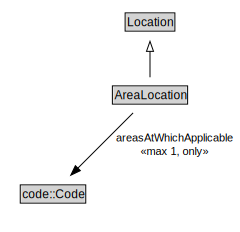

# AreaLocation

<a href="../../diagrams/itsLocation__AreaLocation.dot.svg">Open interactive AreaLocation diagram</a>

## Formalization for AreaLocation

| Property | Constraint |
|----------|------------|
| areasAtWhichApplicable | all code::Code |
| areasAtWhichApplicable | max 1 owl::Thing |
| subClassOf | Location |

## Other annotations

| Annotation | Value |
|------------|-------|
| xsd::pattern | LocationPattern |

