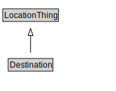

# Destination

<a href="../../diagrams/itsLocation__Destination.dot.svg">Open interactive Destination diagram</a>

## Specializations of Destination

| Class | Description |
|-------|-------------|
| [Area Destination](itsLocation__AreaDestination.md) |  |
| [Point Destination](itsLocation__PointDestination.md) |  |

## Formalization for Destination

| Property | Constraint |
|----------|------------|
| subClassOf | LocationThing |

## Used by classes

| Class | Property |
|-------|----------|
| [Itinerary](itsLocation__Itinerary.md) | routeDestination |

## Other annotations

| Annotation | Value |
|------------|-------|
| xsd::pattern | LocationPattern |

