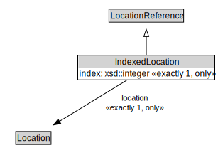

# IndexedLocation

<a href="../../diagrams/itsLocation__IndexedLocation.dot.svg">Open interactive IndexedLocation diagram</a>

## Formalization for IndexedLocation

| Property | Constraint |
|----------|------------|
| index | all xsd::integer |
| index | exactly 1 owl::Thing |
| location | all Location |
| location | exactly 1 owl::Thing |
| subClassOf | LocationReference |

## Used by classes

| Class | Property |
|-------|----------|
| [Itinerary By Indexed Locations](itsLocation__ItineraryByIndexedLocations.md) | locationContainedInItinerary |

## Other annotations

| Annotation | Value |
|------------|-------|
| xsd::pattern | LocationPattern |

