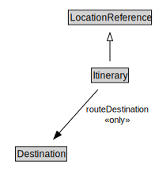

# Itinerary

<a href="../../diagrams/itsLocation__Itinerary.dot.svg">Open interactive Itinerary diagram</a>

## Specializations of Itinerary

| Class | Description |
|-------|-------------|
| [Itinerary By Indexed Locations](itsLocation__ItineraryByIndexedLocations.md) |  |

## Formalization for Itinerary

| Property | Constraint |
|----------|------------|
| routeDestination | all Destination |
| subClassOf | LocationReference |

## Other annotations

| Annotation | Value |
|------------|-------|
| xsd::pattern | LocationPattern |

