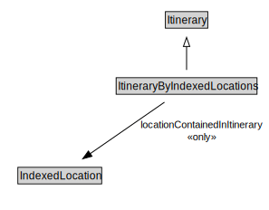

# ItineraryByIndexedLocations

<a href="../../diagrams/itsLocation__ItineraryByIndexedLocations.dot.svg">Open interactive ItineraryByIndexedLocations diagram</a>

## Formalization for ItineraryByIndexedLocations

| Property | Constraint |
|----------|------------|
| locationContainedInItinerary | all IndexedLocation |
| subClassOf | Itinerary |

## Other annotations

| Annotation | Value |
|------------|-------|
| xsd::pattern | LocationPattern |

