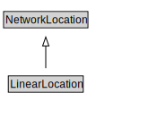

# LinearLocation

<a href="../../diagrams/itsLocation__LinearLocation.dot.svg">Open interactive LinearLocation diagram</a>

## Formalization for LinearLocation

| Property | Constraint |
|----------|------------|
| subClassOf | NetworkLocation |

## Other annotations

| Annotation | Value |
|------------|-------|
| xsd::pattern | LocationPattern |

