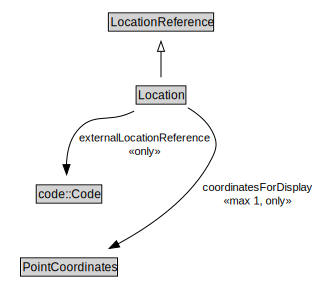

# Location

<a href="../../diagrams/itsLocation__Location.dot.svg">Open interactive Location diagram</a>

## Specializations of Location

| Class | Description |
|-------|-------------|
| [Area Location](itsLocation__AreaLocation.md) |  |
| [Linear Location](itsLocation__LinearLocation.md) |  |
| [Network Location](itsLocation__NetworkLocation.md) |  |
| [Point Location](itsLocation__PointLocation.md) |  |

## Formalization for Location

| Property | Constraint |
|----------|------------|
| coordinatesForDisplay | all PointCoordinates |
| coordinatesForDisplay | max 1 owl::Thing |
| externalLocationReference | all code::Code |
| subClassOf | LocationReference |

## Used by classes

| Class | Property |
|-------|----------|
| [Indexed Location](itsLocation__IndexedLocation.md) | location |
| [Location Group By List](itsLocation__LocationGroupByList.md) | locationContainedInGroup |

## Other annotations

| Annotation | Value |
|------------|-------|
| xsd::pattern | LocationPattern |

